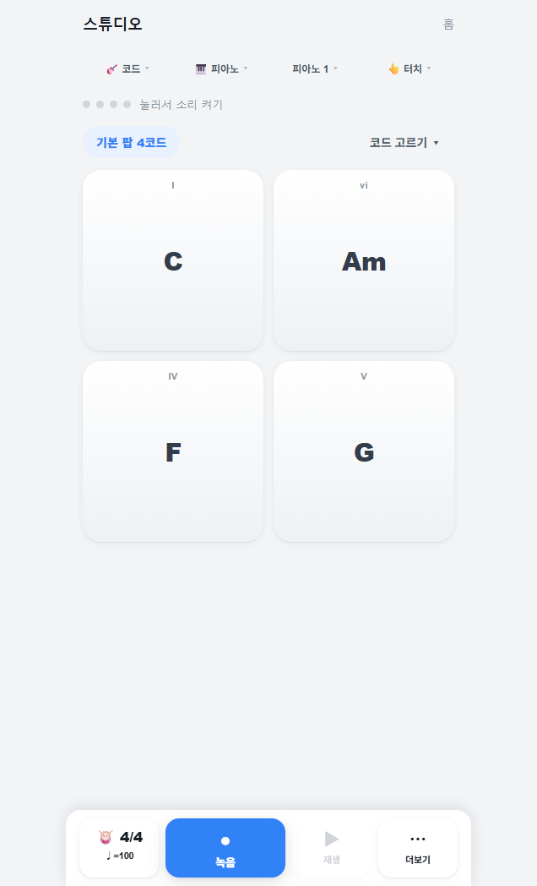
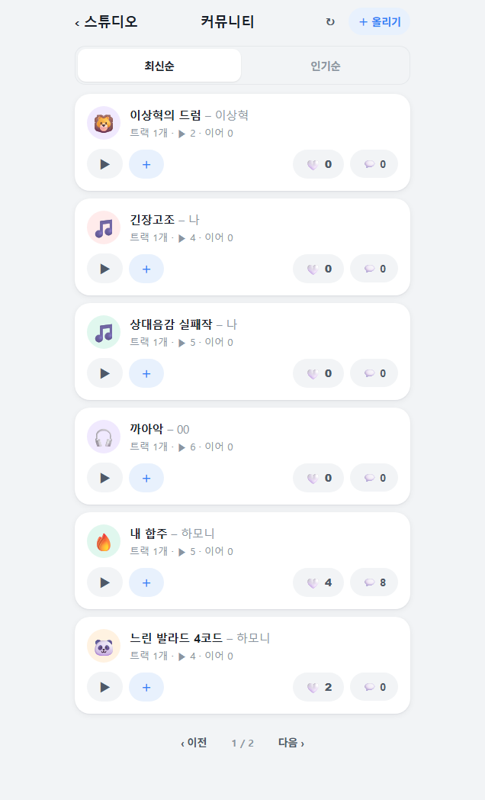
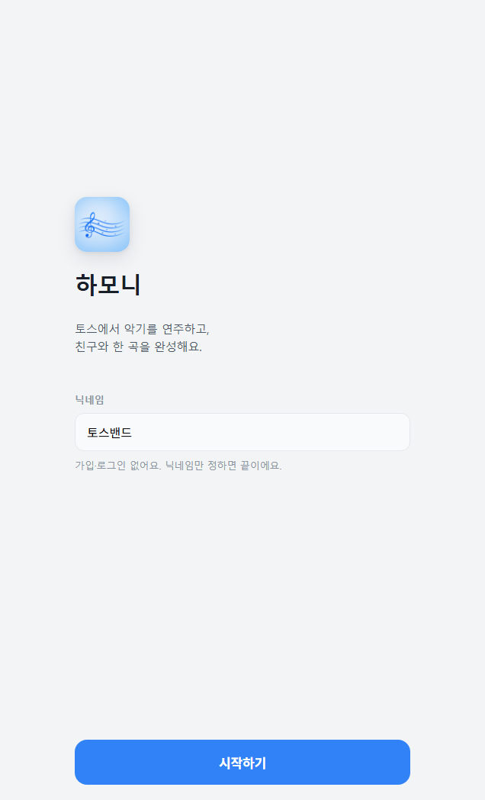
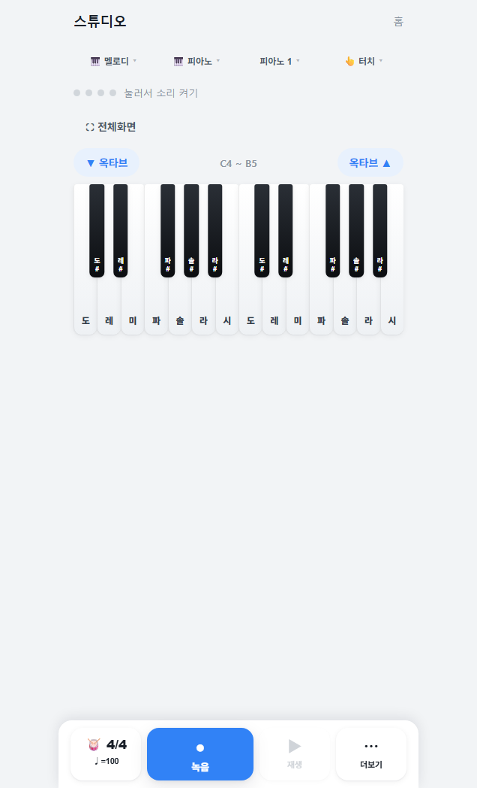
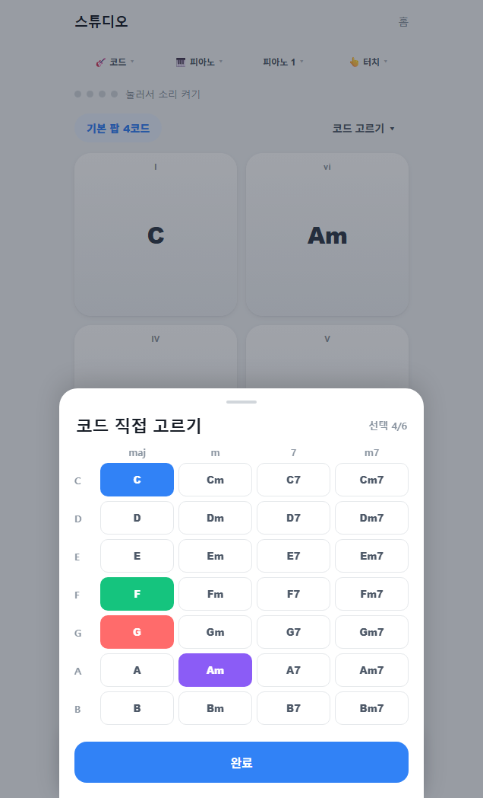
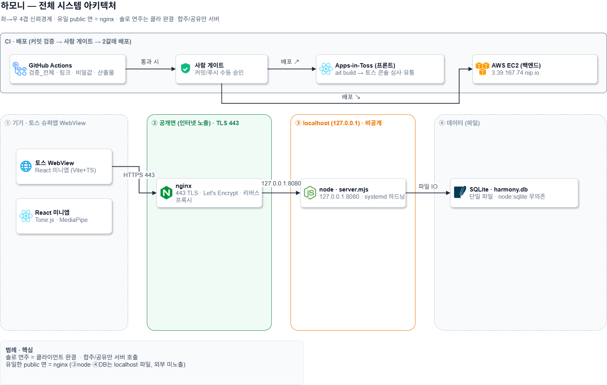

# 하모니 · Harmony

**악기 없이도 함께하는 비동기 합주, 앱인토스 미니앱**


<p align="center">
  
  
  
</p>

토스 미니앱 안에서 코드·멜로디·드럼을 연주하고 녹음한 뒤, 다른 사람의 트랙 위에 내 레이어를 얹어 한 곡을 함께 완성하는 서비스다. 회원가입 없이 닉네임만으로 시작하고, 터치와 카메라 손 제스처로 연주한다.

- **출시**: 앱인토스 「하모니」 정식 전체공개 (2026-06-26)
- **개발**: 4인 팀, 7일 (2026-06-19 ~ 06-26)
- **백엔드**: AWS 라이브 운영, `https://3.39.167.74.nip.io`

---

## 주요 기능

| 기능 | 설명 |
|---|---|
| **가입 없이 시작** | 닉네임만 입력하면 익명 식별키를 발급해 바로 연주한다. 로그인·회원가입 없음. |
| **28코드·멜로디·드럼·기타/베이스** | 7루트 × 4종류(maj·m·7·m7) 코드 패드, 피아노 멜로디 건반, 드럼 8패드, 크로매틱 계이름 패드. 악기 4종에 스타일 2종씩. |
| **터치 + 카메라 제스처** | MediaPipe로 양손을 추적해 손 위치를 코드·드럼으로 매핑한다. 카메라를 못 쓰면 터치로 폴백한다. |
| **녹음·재생·음 편집** | 녹음한 결과를 재생바로 듣고, 피아노롤에서 위치·길이·조옮김·퀀타이즈를 편집한다. |
| **비동기 합주** | 연주를 공유 코드로 올리고, 친구의 코드로 트랙을 불러와 내 레이어를 얹는다. 1.5초 폴링으로 동기화한다. |
| **커뮤니티 보드** | 공개곡에 좋아요·댓글·신고·가져오기. 서로 다른 신고가 3건 쌓이면 자동으로 숨긴다. |

## 화면

| 온보딩 | 스튜디오 | 멜로디 모드 |
|---|---|---|
|  |  |  |
| **제스처 연주** | **코드 직접 고르기** | **커뮤니티** |
|  |  |  |

## 기술 스택

- **프론트엔드** React 18, TypeScript, Vite 6, Granite(앱인토스 프레임워크), TDS
- **오디오** Tone.js 합성·샘플 엔진. lookAhead 0.02초로 입력 지연을 줄였다.
- **제스처** MediaPipe Tasks Vision (HandLandmarker, FaceDetector)
- **백엔드** Node 내장 `node:http` + `node:sqlite` + `node:crypto`. 외부 의존성 없음.
- **인프라** AWS Ubuntu, nginx(TLS) + systemd + Let's Encrypt. 정적 앱과 API를 같은 HTTPS 도메인에서 서빙.

## 시스템 구조

<p align="center">
  
</p>

솔로 연주는 클라이언트에서 완결되고, 합주와 커뮤니티 공유만 서버를 거친다. 연주 입력은 `NoteEvent`로 정규화한 뒤 로컬 저장(localStorage) 또는 서버 세션(SQLite)으로 흐른다. 백엔드는 무외부의존 단일 프로세스로, 신고 자동 숨김·IDOR 차단·좋아요 토글·IP 레이트리밋을 코드에서 직접 처리한다.

## 개발 방식: AI 멀티에이전트 파이프라인

코드와 문서를 역할이 분리된 3에이전트 파이프라인으로 만들었다. 이 프로젝트의 차별점은 결과물뿐 아니라 만든 과정 자체에 있다.

- **통제면 · ChatGPT Pro** 요구사항, 정책, 수락 기준, 출시 판정
- **실행면 · Claude Code, Codex** 설계·구현·테스트. 한 작업에서 두 도구가 같은 파일을 동시에 수정하지 않는다.
- **승인면 · 사람** 범위·병합·배포의 최종 책임. AI는 승인자가 아니다.

상태는 대화 기억이 아니라 저장소 문서로 주고받는다. 작업지시서(TASK), 독립검토서(REVIEW), 결정요청서(DECISION) 세 종류다. 모든 P0 변경은 **다른 계열의 AI가 독립 검토**한 뒤 사람이 승인한다.

교차검증이 실제로 결함을 잡은 기록:

- Codex가 커밋 헬퍼의 경로 보호 우회를 임시 저장소에서 재현해 **NO-GO** 판정, 수정 뒤 통과 (REVIEW-011 → 012)
- 오디오 PR을 코드 품질은 통과로 보면서도 소유권 문서 모순으로 **Rework** (REVIEW-032)
- 출시 후 Codex가 테스트를 직접 실행해(단위 58/58, 타입 0, 보안 7/7, 헬스체크 200, 모두 exit 0) 교차 감사하고 문서·코드 불일치 2건을 지적 (REVIEW-055)

검토 기록은 [`산출물/09_AI개발파이프라인/독립검토서/`](산출물/09_AI개발파이프라인/독립검토서)에 그대로 남아 있다.

## 품질·배포

| 항목 | 결과 |
|---|---|
| 단위 테스트 (vitest) | 58 / 58 |
| 통합 테스트 | 34 / 34 (API 12 · 보안 7 · 클라 6 · 실기기 9) |
| 보안 블랙박스 | 7 / 7 (IDOR·소유권·레이트리밋·멱등) |
| 타입체크 / 빌드 | tsc 0 errors, 빌드 통과 |
| 실기기 검수 | 아이폰 13, 갤럭시 S23 Ultra |
| 배포 | AWS 라이브 + 앱인토스 정식 출시 |

## 빠른 시작

```bash
# 프론트엔드
cd apps/miniapp
npm install
npm run dev:web        # 로컬 개발 (port 5173)
npm run build:web      # 프로덕션 빌드

# 백엔드 (Node 22.5+)
cd apps/api
node server.mjs        # node:sqlite, 외부 의존성 없음
```

## 프로젝트 정보

- **기간** 2026-06-19 ~ 06-26 (7일)
- **팀** 이상혁(팀장·제품/정책) · 곽소정(UX/프런트) · 김민혁(백엔드/데이터) · 양록빈(QA/릴리즈)
- **주요 문서** [앱 개발 종료보고서](산출물/99_제출파일/하모니_앱_개발_종료보고서.md) · [프로그램 목록](산출물/05_개발설계/프로그램_목록.md) · [시스템 구성도](산출물/04_시스템설계/시스템_구성도.md) · [통합테스트 결과서](산출물/06_테스트/통합테스트_결과서.md)
- **개발 규칙·하네스** [CLAUDE.md](CLAUDE.md) · [AGENTS.md](AGENTS.md) · [산출물/09_AI개발파이프라인](산출물/09_AI개발파이프라인)

<sub>비게임 미니앱 · 앱인토스 출품 프로젝트</sub>
