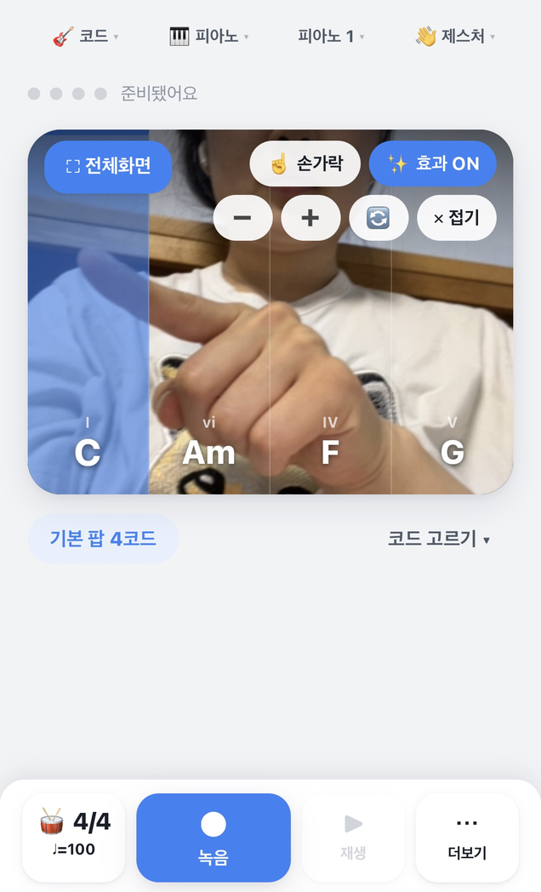
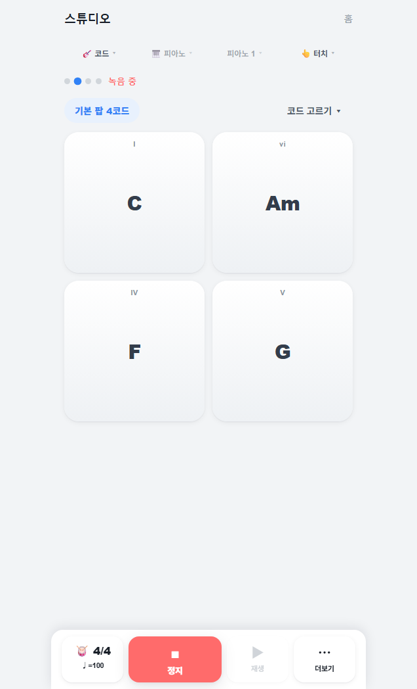
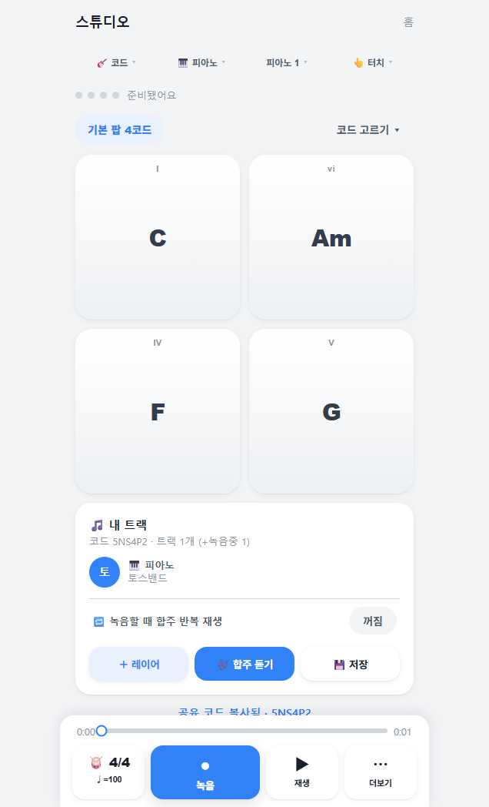
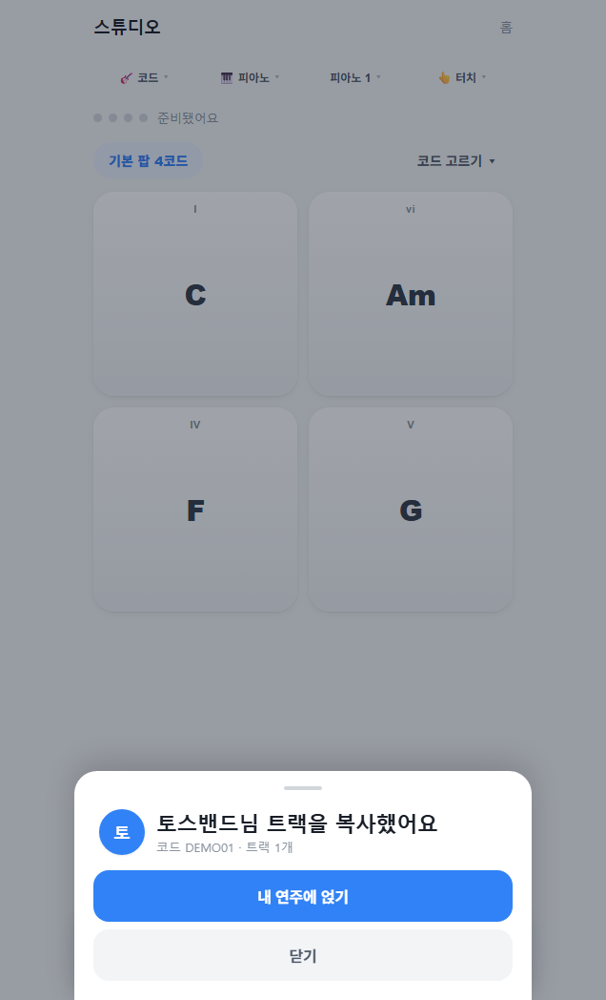
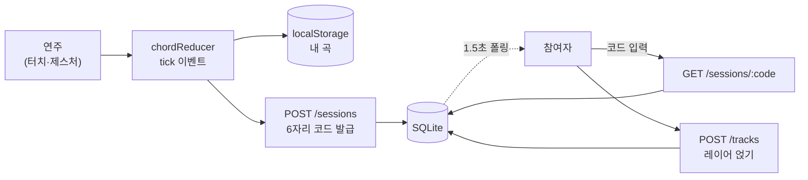

<a id="top"></a>

# 하모니 · Harmony

**악기 없이도 함께하는 비동기 합주, 앱인토스 미니앱**

코드·멜로디·드럼을 터치와 카메라 손 제스처로 연주하고, 친구의 트랙 위에 내 레이어를 얹어 한 곡을 함께 완성한다. 회원가입 없이 닉네임만으로 시작한다.


**[앱인토스 「하모니」 출시](https://apps-in-toss.com)** · [앱 개발 종료보고서](산출물/99_제출파일/하모니_앱_개발_종료보고서.md) · [발표 자료](산출물/99_제출파일/최종발표)

<p align="center">
  
  
  
</p>

---

## 목차

- [소개](#소개)
- [핵심 기능](#핵심-기능)
- [사용 흐름](#사용-흐름)
- [기술 스택](#기술-스택)
- [시스템 구조](#시스템-구조)
- [기술적으로 신경 쓴 부분](#기술적으로-신경-쓴-부분)
- [품질·테스트](#품질테스트)
- [변경 통제와 교차 검증](#변경-통제와-교차-검증)
- [빠른 시작](#빠른-시작)
- [프로젝트 구조](#프로젝트-구조)
- [회고와 배운 점](#회고와-배운-점)
- [팀](#팀)

---

## 소개

밴드나 합주는 같은 시간, 같은 공간, 그리고 악기를 다룰 줄 아는 사람이 필요하다. 하모니는 이 세 가지 조건을 모두 없애는 데서 출발했다. 악기가 없어도 코드 패드를 누르면 소리가 나고, 같은 시간에 모이지 않아도 친구가 올린 트랙 위에 내 연주를 얹으면 합주가 된다.

7일이라는 짧은 기간 안에 실제로 배포해 시연 가능한 상태까지 만드는 것이 목표였다. 그래서 처음부터 범위를 좁혔다. 실시간 스트리밍 합주, 계정과 소셜 그래프, 결제는 이번 범위가 아니다. 대신 "혼자서도 한 곡을 완성하고, 그 곡이 공유로 확장되는" 한 흐름을 끝까지 동작하게 만드는 데 집중했다.

- **기간** 2026-06-19 ~ 06-26 (7일), 4인 팀
- **결과** 앱인토스 정식 전체공개 출시(2026-06-26), AWS 백엔드 라이브 운영
- **분류** 비게임 미니앱, 익명 식별(`getAnonymousKey`) 기반, 사업자 없이 데모 범위

<sub>[맨 위로](#top)</sub>

## 핵심 기능

| 기능 | 설명 |
|---|---|
| **가입 없이 시작** | 닉네임만 입력하면 익명 식별키를 발급해 바로 연주한다. 로그인·회원가입 없음. |
| **28코드·멜로디·드럼·기타/베이스** | 7루트 × 4종류(maj·m·7·m7) 코드 패드, 피아노 멜로디 건반, 드럼 8패드, 크로매틱 계이름 패드. 악기 4종에 스타일 2종씩. |
| **터치 + 카메라 제스처** | MediaPipe로 양손을 추적해 손 위치를 코드·드럼으로 매핑한다. 카메라를 못 쓰면 터치로 폴백한다. |
| **녹음·재생·음 편집** | 녹음한 결과를 재생바로 듣고, 피아노롤에서 위치·길이·조옮김·퀀타이즈를 편집한다. |
| **비동기 합주** | 연주를 공유 코드로 올리고, 친구의 코드로 트랙을 불러와 내 레이어를 얹는다. 1.5초 폴링으로 동기화한다. |
| **커뮤니티 보드** | 공개곡에 좋아요·댓글·신고·가져오기. 서로 다른 신고가 3건 쌓이면 자동으로 숨긴다. |

<sub>[맨 위로](#top)</sub>

## 사용 흐름

온보딩에서 합주까지, 한 사람이 곡을 만들어 공유하면 다른 사람이 받아 얹는 흐름이다.

| 1. 온보딩 | 2. 스튜디오 | 3. 녹음 | 4. 공유 | 5. 커뮤니티 |
|---|---|---|---|---|
|  |  |  |  |  |

<details>
<summary><b>화면 더 보기</b> (멜로디·코드 선택·가져오기·실기기)</summary>

<br>

| 멜로디 모드 | 코드 직접 고르기 | 가져와 얹기 | 실기기 손 인식 |
|---|---|---|---|
|  |  |  |  |

실기기 검증 사진(아이폰 13·갤럭시 S23 Ultra) 9장은 [`평가증빙/실기기_스크린샷/`](평가증빙/실기기_스크린샷)에 있다.

</details>

<sub>[맨 위로](#top)</sub>

## 기술 스택

| 영역 | 사용 기술 |
|---|---|
| 프론트엔드 | React 18, TypeScript, Vite 6, Granite(앱인토스 프레임워크), TDS |
| 오디오 | Tone.js 합성·샘플 엔진 |
| 제스처 | MediaPipe Tasks Vision (HandLandmarker, FaceDetector) |
| 백엔드 | Node 내장 `node:http` + `node:sqlite` + `node:crypto` (외부 의존성 없음) |
| 인프라 | AWS Ubuntu, nginx(TLS), systemd, Let's Encrypt |
| 테스트·CI | Vitest, GitHub Actions, 자체 검증 스크립트 |

<sub>[맨 위로](#top)</sub>

## 시스템 구조

솔로 연주는 클라이언트에서 완결되고, 합주와 커뮤니티 공유만 서버를 거친다. 연주 입력은 `NoteEvent`로 정규화한 뒤 로컬 저장(localStorage) 또는 서버 세션(SQLite)으로 흐른다.

<p align="center">
  
</p>

합주 데이터 흐름은 다음과 같다. 원작자가 코드를 발급하고, 참여자가 그 코드로 트랙을 받아 자신의 레이어를 얹는다.



백엔드는 무외부의존 단일 프로세스로, 신고 자동 숨김·IDOR 차단·좋아요 토글·IP 레이트리밋을 코드에서 직접 처리한다. 자세한 구성도와 ERD는 [시스템 구성도](산출물/04_시스템설계/시스템_구성도.md)에 있다.

<sub>[맨 위로](#top)</sub>

## 기술적으로 신경 쓴 부분

### 1. 실시간 연주 입력의 체감 지연 줄이기

브라우저 Web Audio는 기본 스케줄 lookahead가 0.1초라 터치나 제스처가 한 박자 늦게 들리는 문제가 있었다. `unlockAudio()`에서 오디오 컨텍스트의 `lookAhead`와 `updateInterval`을 0.02초로 함께 낮춰 입력에서 소리까지의 지연을 약 20ms 수준으로 끌어내렸다. 연주·녹음·메트로놈은 벽시계가 아니라 오디오 클럭(`audioNow()` = `Tone.now()`)을 기준으로 스케줄해 박자 정확도를 맞췄고, 합주 재생은 트랙마다 독립 보이스(`createVoice`)를 시각 인자와 함께 트리거한다. 음원은 실제 악기 샘플을 우선 쓰되 로딩 전이나 실패 시에는 합성 보이스로 폴백해 항상 소리가 나도록 했다. <sub>`apps/miniapp/src/audio/engine.ts`</sub>

### 2. 합주를 실시간 대신 비동기 레이어로 설계

밴드 합주를 실시간 오디오 스트리밍으로 하면 네트워크 왕복 지연 때문에 박자가 어긋난다. 그래서 WebSocket 실시간 동기화 대신 공유 코드 기반의 비동기 레이어 방식을 택했다. 각자 메트로놈에 맞춰 자기 트랙을 녹음한 뒤 같은 코드의 세션에 얹고, 클라이언트는 1.5초 주기로 세션을 폴링해 새 트랙을 받아온다. 레이턴시와 구현 복잡도를 함께 줄이는 트레이드오프이며, 이 결정의 배경과 컷라인은 [의사결정 기록](산출물/00_프로젝트관리/의사결정_기록.md)에 남겼다. <sub>`apps/miniapp/src/lib/share.ts`, `routes/Studio.tsx`</sub>

### 3. 외부 의존성 0인 백엔드

공유 백엔드는 Node 내장 모듈만으로 작성했다. `node:http`로 서버를, `node:sqlite`로 저장소를, `node:crypto`로 코드 생성과 콘텐츠 해시를 처리해 `package.json`에 의존성이 한 줄도 없다. 기존 DB와의 호환을 위해 컬럼 추가는 try로 감싼 멱등 `ALTER TABLE`로 돌리고, 같은 곡의 중복 게시는 첫 트랙을 결정적으로 직렬화한 sha1 해시로 걸러 동일 작성자의 같은 곡을 기존 코드로 멱등 반환한다. <sub>`apps/api/server.mjs`</sub>

### 4. 카메라 손 제스처를 코드와 드럼 입력으로 매핑

MediaPipe HandLandmarker로 양손 21개 랜드마크를 추적해 손 위치를 화면 가로 구간(존)으로 나누고, 손을 편 상태와 검지 하나만 편 상태를 구분해 코드 지속음과 드럼 타격으로 매핑한다. FaceDetector로 얼굴 상하 움직임을 추적해 헤드뱅잉을 효과음으로 연결했고, 얼굴 검출기는 베스트에포트로 한 번만 로드를 시도해 실패해도 손 제스처는 유지된다. 카메라 자체가 막히면 터치 입력으로 폴백한다. <sub>`apps/miniapp/src/audio/gesture.ts`, `gestureFx.ts`</sub>

### 5. 무인증 공유 환경에서의 보안과 모더레이션

계정 없이 코드만으로 접근하는 데모 구조라 약한 지점을 서버에서 막았다. 공개된 세션에는 소유자 키가 일치할 때만 트랙을 추가할 수 있게 해 공개 코드로 남의 곡을 오염시키는 것을 403으로 차단하고(IDOR 방지), 댓글은 서로 다른 신고자 3명이 모이면 자동으로 숨긴다. 레이트리밋과 신고자 식별은 클라이언트가 보내는 키가 아니라 서버가 도출한 IP로 버킷팅해 키 회전 우회를 막았고, 좋아요는 익명 키당 한 번만 반영되는 멱등 토글로 처리한다. 비공개 세션 코드는 추측을 막기 위해 암호학적 난수로 생성한다. <sub>`apps/api/server.mjs`</sub>

### 6. 순수 도메인 로직을 UI에서 분리해 단위테스트로 고정

코드 입력 판정, 녹음 이벤트와 편집 노트의 변환·퀀타이즈, 이벤트 정규화 같은 핵심 규칙을 UI 컴포넌트에서 떼어 순수 함수로 분리했다. 코드 reducer는 같은 코드 중복 noteOn 방지, 터치 우선과 제스처 무시 게이트, 멜로디 폴리포니 같은 규칙을 상태 전이로 다루고, 이 분리 덕분에 도메인 로직을 58개 단위테스트로 검증할 수 있었다. <sub>`apps/miniapp/src/audio/chordReducer.ts`, `lib/noteEdit.ts`, `audio/events.ts`</sub>

<sub>[맨 위로](#top)</sub>

## 품질·테스트

| 항목 | 결과 | 방법 |
|---|---|---|
| 단위 테스트 | 58 / 58 | Vitest, 순수 도메인 로직 7개 파일 |
| 통합 테스트 | 34 / 34 | API 12 · 보안 7 · 클라 6 · 실기기 9 |
| 보안 블랙박스 | 7 / 7 | IDOR·소유권·레이트리밋·멱등·신고 우회 |
| 타입체크 / 빌드 | 0 errors / 통과 | `tsc --noEmit`, `vite build` |
| 실기기 검수 | 통과 | 아이폰 13, 갤럭시 S23 Ultra |
| 배포 | 라이브 | AWS 운영 + 앱인토스 정식 출시 |

<sub>[맨 위로](#top)</sub>

## 변경 통제와 교차 검증

7일 일정에 4명이 같은 저장소를 동시에 고치는 조건이라, 리뷰를 사람 눈에만 맡기면 놓치는 게 생긴다고 봤다. 그래서 검증 절차를 문서와 종료 코드로 강제하는 구조를 먼저 만들고 개발을 시작했다.

- 상태를 대화가 아니라 저장소 문서로 주고받는다. 작업지시서(TASK), 독립검토서(REVIEW), 결정요청서(DECISION) 세 종류이며 전부 커밋에 남는다.
- P0 변경은 구현한 쪽이 아닌 독립된 검토자가 재현까지 마친 뒤에야 병합한다.
- 검토 판정은 의견이 아니라 실행 결과다. 테스트·타입·보안 검사·헬스체크가 모두 exit 0이어야 통과로 본다.
- 병합과 배포의 최종 책임은 사람이 진다. 자동 판정은 게이트일 뿐 승인자가 아니다.

이 절차가 실제로 잡아낸 것:

- 커밋 헬퍼의 경로 보호 우회를 임시 저장소에서 재현해 NO-GO 판정, 수정 후 통과 (REVIEW-011 to 012)
- 오디오 PR을 코드 품질은 통과로 보면서도 소유권 문서와의 모순 때문에 Rework (REVIEW-032)
- 출시 후 교차 감사에서 단위 58/58, 타입 0, 보안 7/7, 헬스체크 200을 직접 실행해 확인하고 문서·코드 불일치 2건을 지적 (REVIEW-055)

검토 기록 원본은 [`산출물/09_AI개발파이프라인/독립검토서/`](산출물/09_AI개발파이프라인/독립검토서)에 그대로 있다. 구현 보조에 생성형 도구를 썼고, 그 결과를 그대로 신뢰하지 않기 위해 위 절차를 설계했다.

<sub>[맨 위로](#top)</sub>

## 빠른 시작

```bash
# 프론트엔드 (앱인토스 미니앱)
cd apps/miniapp
npm install
npm run dev:web        # 로컬 개발 서버 (port 5173)
npm run build:web      # 프로덕션 빌드

# 백엔드 (공유 API, Node 22.5+)
cd apps/api
node server.mjs        # node:sqlite, 외부 의존성 없음
```

> 미니앱이 공유 API를 호출하려면 `apps/miniapp/.env`에 `VITE_API_BASE=https://3.39.167.74.nip.io`를 설정한다.

<sub>[맨 위로](#top)</sub>

## 프로젝트 구조

```text
apps/
  miniapp/                 React + Vite + Granite 미니앱
    src/
      routes/              스플래시·온보딩·홈·스튜디오·커뮤니티·설정
      audio/               엔진·코드 reducer·트랜스포트·제스처
      components/studio/   코드 매트릭스·패드·프렛보드·음 편집기
      lib/                 합주 공유·익명 식별·로컬 저장
  api/
    server.mjs             node:http + node:sqlite 공유 API
    deploy/                nginx·systemd·certbot·deploy.sh
tooling/                   검증·커밋 스크립트, git 훅
산출물/                    기획·설계·테스트·배포·AI 파이프라인 문서
평가증빙/                  테스트·실기기·AI 활용 증거
```

<sub>[맨 위로](#top)</sub>

## 회고와 배운 점

- **리스크가 큰 기능은 일찍 검증한다.** 첫 아이디어를 6월 21일에 접고 악기 합주로 전환했다. 카메라 제스처처럼 구현 가능성이 불확실한 핵심 기능을 초반에 스파이크로 검증한 덕분에, 안 될 기능을 끝까지 붙잡지 않을 수 있었다.
- **제약을 먼저 인정하면 설계가 단순해진다.** 실시간 합주의 레이턴시 문제를 정면으로 풀기보다 비동기 레이어로 우회했다. 토스 WebView의 외부 리소스 제약도 합성 폴백으로 받아들였다. 못 하는 것을 정하고 나니 할 일이 분명해졌다.
- **플랫폼 등록은 일정 초반에 끝낸다.** 앱 등록과 식별자(`appName`) 확정이 막판 크리티컬 패스가 됐다. 다음에는 착수 직후 실제 등록 ID까지 박아두기로 했다.
- **검증은 의견이 아니라 실행 결과로 강제해야 한다.** 구현한 쪽이 아닌 독립 검토자가 재현하고 exit 코드로 판정하게 했더니, 보안 우회와 문서·코드 불일치를 병합 전에 잡아냈다.

<sub>[맨 위로](#top)</sub>

## 팀

4인 팀 프로젝트다. 역할은 다음과 같다.

| 역할 | 담당 |
|---|---|
| 제품·정책·팀장 | 이상혁 |
| UX·프런트엔드 | 곽소정 |
| 백엔드·데이터 | 김민혁 |
| QA·릴리즈 | 양록빈 |

**문서** [앱 개발 종료보고서](산출물/99_제출파일/하모니_앱_개발_종료보고서.md) · [프로그램 목록](산출물/05_개발설계/프로그램_목록.md) · [통합테스트 결과서](산출물/06_테스트/통합테스트_결과서.md) · [개발 규칙·하네스](CLAUDE.md)

<sub>비게임 미니앱 · 앱인토스 출품 프로젝트 · [맨 위로](#top)</sub>
