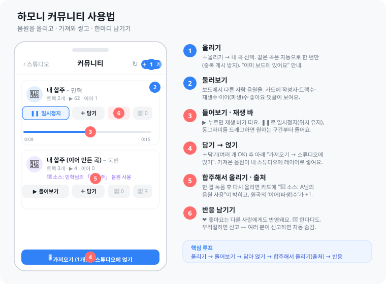
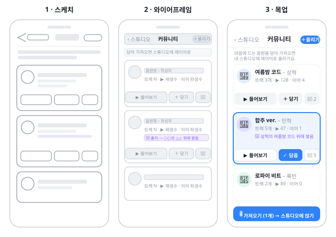
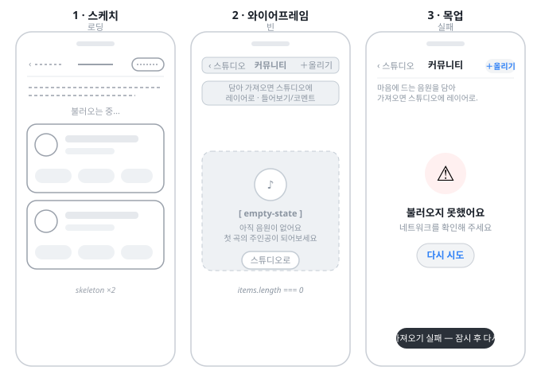
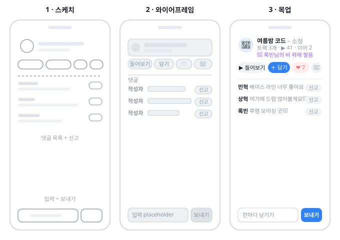
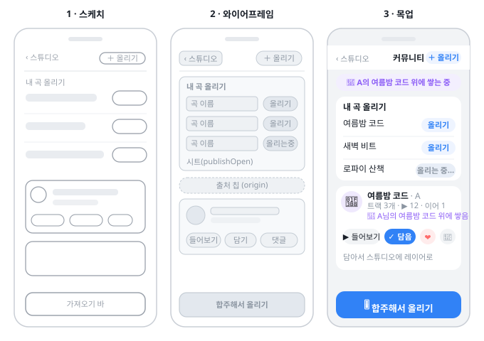

# 하모니 커뮤니티 이미지 명세서 (스케치 → 와이어프레임 → 목업)

> 발표·보고용. **우리가 작업하는 커뮤니티 기능 화면**만 범위로 한정한다. 각 화면을 **스케치(러프) → 와이어프레임(구조·라벨) → 목업(고충실)** 3단계로 한 장에 담았다. **목업은 정합 머지된 `Community.tsx`(as-built) 기준**이라 실제 화면과 일치한다(기능 정의는 [기능명세서 v4](../05_개발설계/하모니_커뮤니티_기능명세서.md)).
> SVG 원본은 `커뮤니티_이미지/` 폴더(브라우저·슬라이드에서 열림). 6시선 검증 통과(경미 레이아웃 메모만).
>
> **v4 갱신(2026-06-23, 리허설 후):** 도움말 가이드(`커뮤니티_도움말_가이드.svg`) 추가. 기존 3단계 4종은 v3-era 목업이라 다음 as-built 변화가 미반영 — **① 재생 바**(들어보기 시 play/pause·스크럽), **② 좋아요 하트 노출**(OQ-D 진짜 구현+노출), **③ 출처 카피**가 "○○ 위에 쌓음"→**"소스: A님의 음원 사용"**. 가이드 SVG는 이 셋을 반영한 현행본이다.

## 화면 목록
| 화면 | 파일 | 담은 내용 |
|---|---|---|
| **도움말 가이드** | `커뮤니티_이미지/커뮤니티_도움말_가이드.svg` | **폰 목업(콜아웃 ①~⑥) + 6단계 사용법**(올리기·둘러보기·들어보기 재생바·담기와 얹기·합주해서 올리기 출처·반응). 재생바·좋아요·"소스" 출처 반영 |
| 커뮤니티 보드 | `커뮤니티_이미지/커뮤니티_보드.svg` | 앱바(‹스튜디오·커뮤니티·＋올리기) + 이모지 아바타 카드(음원명–작성자·트랙/재생/파생 메타·출처 크레딧·들어보기/담기/댓글) ※v3-era |
| 보드 3상태 | `커뮤니티_이미지/커뮤니티_상태.svg` | 로딩(스켈레톤) / 빈("첫 곡의 주인공") / 실패("다시 시도") |
| 댓글 패널 | `커뮤니티_이미지/커뮤니티_댓글.svg` | 댓글 목록(작성자·텍스트·신고) + 입력("한마디 남기기")·보내기 |
| 올리기 + 합주해서 올리기 | `커뮤니티_이미지/커뮤니티_올리기.svg` | 내 곡 올리기 시트 + 출처 칩·커뮤니티에 올리기 ※v3-era 카피 |

## 화면별

### 0. 도움말 가이드 (현행 as-built · 발표/온보딩용)

좌측 폰 목업에 콜아웃 ①~⑥, 우측에 6단계 사용법. 두 명세서(기능명세서 v4 §3 핵심 루프 + 화면명세서)를 기반으로 한 한 장 도움말. 재생 바(들어보기), 좋아요 하트, "🎵 소스: A님의 음원 사용" 출처 카피가 현행과 일치한다. 핵심 루프: 올리기→들어보기→담아 얹기→합주해서 올리기(출처)→반응.

### 1. 커뮤니티 보드 (v3-era)

서버 `listCommunity` 기반 카드 목록. 파생 카드엔 보라색 출처 크레딧. ※이 목업은 v3-era라 재생 바 미표시·출처 카피가 구버전("위에 쌓음")·좋아요는 당시 미노출 전제. 현행 카피·재생 바·좋아요 노출은 §0 도움말 가이드를 기준으로 한다.

### 2. 보드 3상태

로딩·빈·실패 — 빈 보드 콜드스타트는 시드곡으로 방어, 실패는 재시도.

### 3. 댓글 패널

평면 댓글(≤200자) + 신고(3건 자동 숨김). 대댓글·멘션 없음.

### 4. 올리기 + 합주해서 올리기

내 곡 올리기(publish) + 가져온 곡 위 "합주해서 올리기"(출처 origin_code 강제).

## 비고
- 충실도 단계는 보고에서 "스케치로 발상 → 와이어로 구조 → 목업으로 확정"의 진화를 보여주는 용도.
- 목업의 이모지 아바타·카드는 곽소정 UI(정합 보존), 데이터·동선은 서버 보드(김민혁).
- 상세 동작/상태/계약은 기능명세서 v3 §4·§7, 화면 SCR 매핑은 화면명세서 참조.
