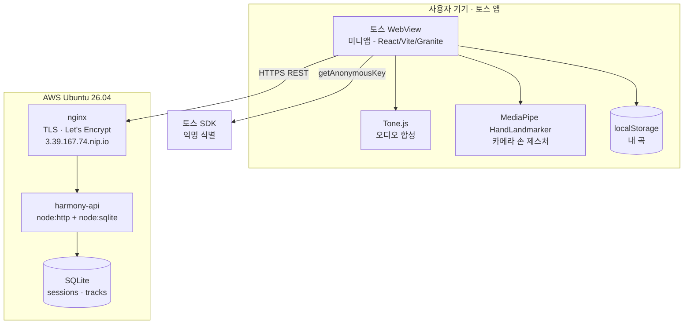

# 시스템 구성도 (하모니)

> 실제 구현·배포 기준. 비동기 합주 미니앱 — 솔로 연주는 클라이언트 완결, 합주 공유만 서버.

## 구성도

## 컴포넌트
| 계층 | 기술 | 역할 |
|---|---|---|
| 미니앱(프론트) | React 18 · TS strict · Vite 6 · @apps-in-toss/web-framework(Granite) · @toss/tds-mobile(TDS) | 연주·녹음·로컬저장·공유 UI |
| 오디오 | Tone.js (PolySynth) | 코드 합성·메트로놈·합주 합쳐듣기(트랙별 음색) |
| 입력 | 터치 + MediaPipe tasks-vision(HandLandmarker) | 4코드존 제스처 / 터치 폴백 |
| 식별 | getAnonymousKey (비게임) | 토스 로그인/회원가입 없이 익명 식별 (DL-016) |
| 백엔드 | Node 24 `node:http` + `node:sqlite` (무의존) | 합주 세션·트랙 CRUD |
| TLS/프록시 | nginx + Let's Encrypt(certbot, nip.io) | HTTPS(토스 WebView 필수) |
| 데이터 | SQLite 파일 | 세션·트랙 영속 (테이블 정의서 참조) |
| 운영 | systemd(`harmony-api`·`nginx`·`certbot.timer`) | 24/7 자동시작·자동갱신 |

## 데이터 흐름 (핵심)
1. 연주(터치/제스처) → `chordReducer`가 tick 기반 이벤트로 기록(벽시계 ms 금지)
2. 로컬 저장: `localStorage`(내 곡) — 서버 불필요
3. 공유: `POST /sessions`(이벤트 업로드) → 코드 발급 → 클립보드
4. 받기: `GET /sessions/:code` → 친구 트랙 로드
5. 얹기: `POST /sessions/:code/tracks`(내 레이어 업로드)
6. 동기화: 클라 1.5초 polling으로 새 트랙 반영(실시간 아님)
7. 합주 듣기: 세션 전체 트랙을 트랙별 음색으로 동시 재생

## 비기능·정책
- HTTPS 필수(토스 WebView 혼합콘텐츠 차단) → nginx+Let's Encrypt.
- 핀치줌 비활성(viewport 메타). 자체 뒤로가기 UI 금지.
- 합주 API 인증 없음(코드=접근권한) — 해커톤 데모 범위. 공개 배포 전 rate-limit·검증 추가 필요(한계 명시).
- 배포 절차: [배포_실행절차서](../07_배포운영/배포_실행절차서.md).
