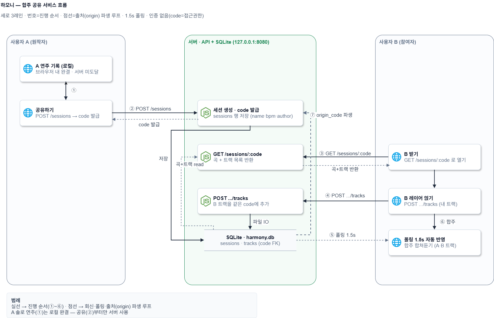
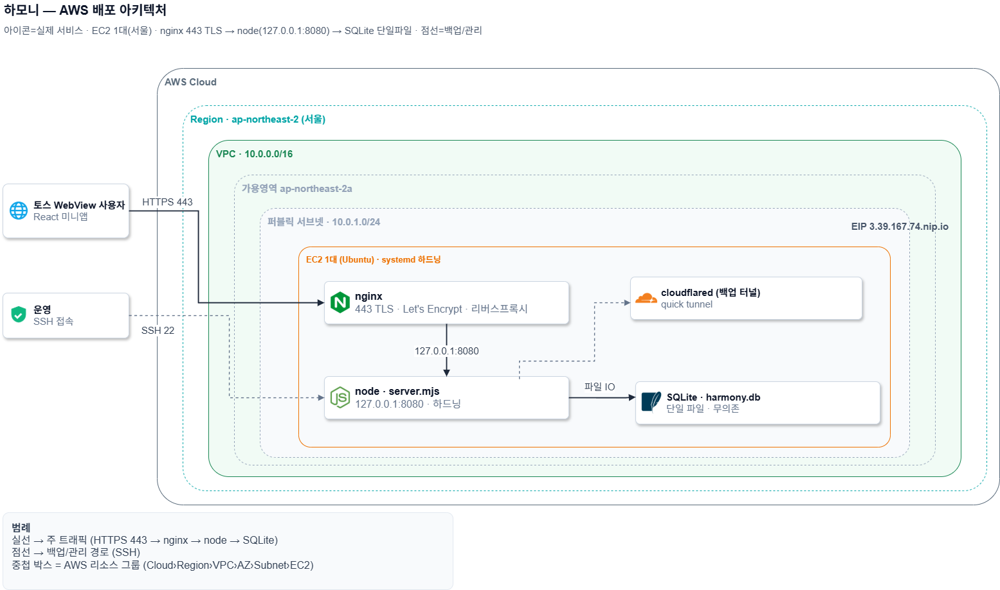
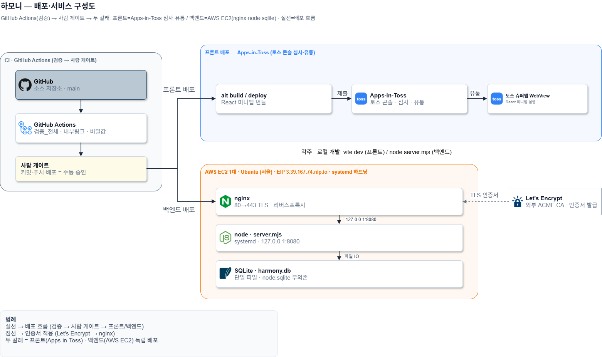
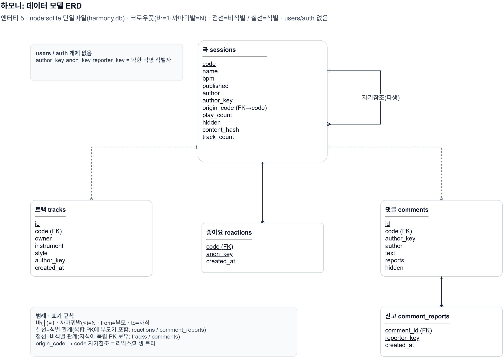
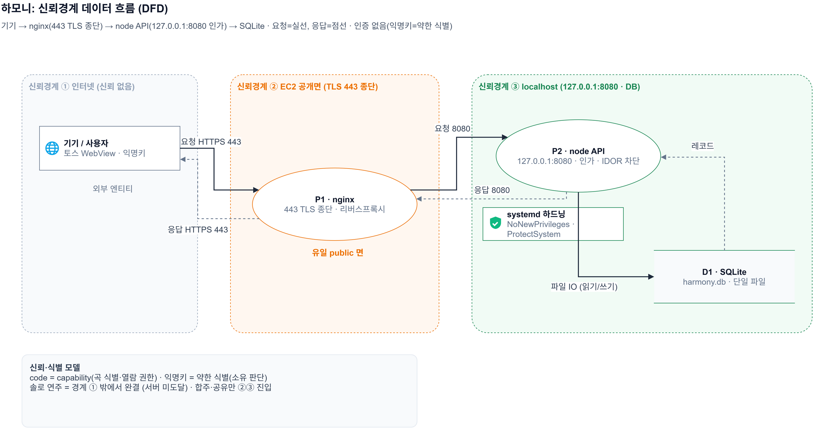
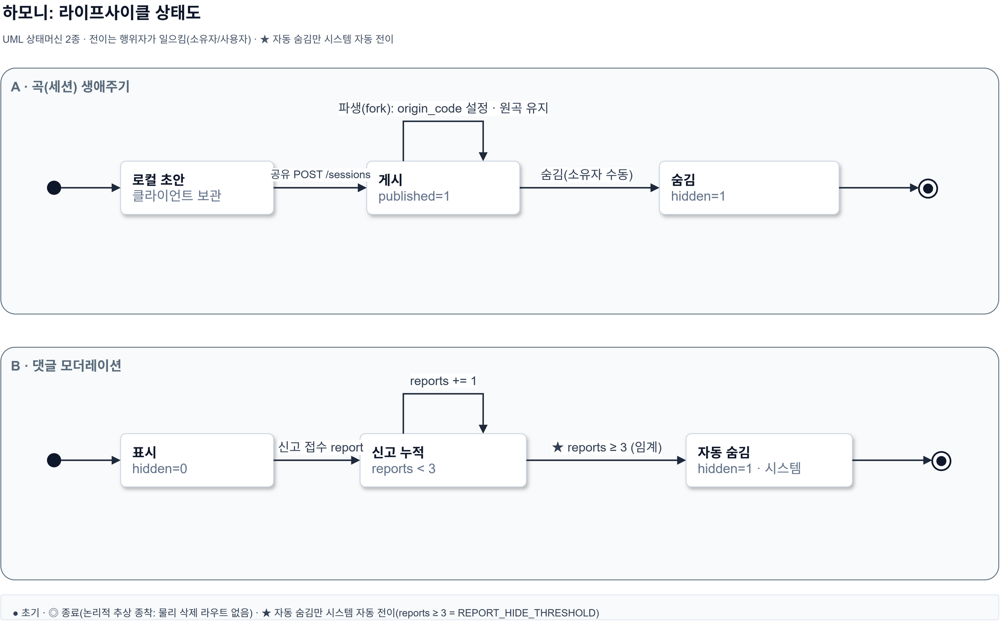

# 하모니 아키텍처 다이어그램 모음 (7종)

> 발표·보고·심사용 고충실 다이어그램. 같은 시스템(하모니)을 **여러 표준 표기로 교차**해서 본다. 각 다이어그램은 **PNG(보기) + .drawio(app.diagrams.net 편집본)** 2형태로 제공한다(SVG 미제공).
> 텍스트 정본은 [시스템_구성도.md](시스템_구성도.md)·[테이블_정의서.md](테이블_정의서.md)·[기능명세서](../05_개발설계/하모니_커뮤니티_기능명세서.md). 이 문서는 그것을 **as-built(실제 `apps/api/server.mjs`·배포 설정) 기준 + 프로덕션(인앱토스 서비스) 관점**으로 시각화한 것이다.

## 산출물 목록

| # | 다이어그램 | 표기 | PNG | drawio |
|---|---|---|---|---|
| 1 | 전체 시스템 아키텍처 | 컨테이너+배포 블록 | `하모니_시스템_아키텍처.png` | `.drawio` |
| 2 | 합주 공유 서비스 흐름 | 스윔레인 | `하모니_서비스_흐름도.png` | `.drawio` |
| 3 | AWS 배포 아키텍처 | AWS 공식 중첩 그룹 | `하모니_AWS_배포_아키텍처.png` | `.drawio` |
| 4 | 배포·서비스 구성도 (Apps-in-Toss 프로덕션) | CI 두갈래 + Apps-in-Toss + AWS | `하모니_배포_인프라_구성도.png` | `.drawio` |
| 5 | 데이터 모델 ERD | ERD · DA# 표기(식별/비식별) | `하모니_데이터모델_ERD.png` | `.drawio` |
| 6 | 신뢰경계 데이터 흐름 | DFD + 신뢰경계 | `하모니_신뢰경계_DFD.png` | `.drawio` |
| 7 | 라이프사이클 상태도 | UML 상태머신 | `하모니_라이프사이클_상태도.png` | `.drawio` |

- `.drawio`는 [app.diagrams.net](https://app.diagrams.net)/VS Code Draw.io 확장에서 **박스·화살표 이동·편집** 가능(아이콘 임베드).
- 아이콘 원본 `아키텍처_아이콘/`, 재생성 스크립트 `_build/`.

## A. 구성·배포 뷰 (1~4) — "무엇이 어디에 있나"

### 1. 전체 시스템 아키텍처

신뢰경계 4겹(기기 → nginx 443 → 127.0.0.1:8080 → SQLite). 솔로=클라 완결, 합주/공유만 서버. 상단 CI·배포 밴드(사람 게이트).

### 2. 합주 공유 서비스 흐름

3레인 스윔레인(A/서버/B). 연주기록 → 공유(코드) → 받기/레이어 → 폴링·합주 → 출처 루프.

### 3. AWS 배포 아키텍처

AWS 공식 중첩 그룹(Cloud›Region›VPC›단일 AZ›서브넷) 안 EC2 1대. 멀티 AZ·ALB·RDS "없음"이 사실 — 한계는 설계 메모로 명시.

### 4. 배포·서비스 구성도 (Apps-in-Toss 프로덕션)

프론트(미니앱)는 `ait deploy`로 **Apps-in-Toss(토스 콘솔 심사·유통)** → 토스 슈퍼앱 WebView에서 실행. 백엔드 API는 AWS(nginx HTTPS·node·sqlite·systemd). CI는 검증 후 두 갈래(프론트=Apps-in-Toss / 백엔드=AWS). 로컬 개발은 각주로 분리.

## B. 데이터·보안·행위 뷰 (5~7) — "작지만 의도적인 설계" (검토회의 만장일치 선정)

### 5. 데이터 모델 ERD (DA# 표기)

DA# 표기 — 개체 = 식별자(PK) 영역[상단·밑줄] + 일반속성 영역[하단], **식별 관계(실선: 좋아요·신고 — 복합키)** vs **비식별 관계(점선: 트랙·댓글·자기참조)**, 까마귀발(N)·바(1). **`sessions.origin_code → sessions.code` 자기참조 = 파생(리믹스) 트리**, **users/auth 개체 부재 = 인증 없음(의도된 데모 범위)**.

### 6. 신뢰경계 데이터 흐름 (DFD)

신뢰경계 2~3겹(외부 엔티티□/프로세스○/스토어▭). **코드=capability·익명키=약한 식별·인증 없음** 모델. 솔로=경계 안 완결(서버 미도달). 잔여위험(code 열거·신고자 위조)을 Known Limitation으로 정직 표기.

### 7. 라이프사이클 상태도

상태머신 2개. **곡(세션)**: 로컬 초안→게시→파생(fork)/숨김(소유자 수동). **댓글 모더레이션**: 표시→신고 3건(`REPORT_HIDE_THRESHOLD`)→자동 숨김(★유일한 자동 전이).

## 시니어 설계 관점 (발표 포인트)
- **유일 public 면 = nginx**, API는 `127.0.0.1` 바인드로 노출면을 주소로 차단.
- **백업 공백(빨강) = 최대 운영 리스크** — SQLite 단일 파일, 백업 없음 → 공개배포 1순위.
- **인증 없음 = 의도된 데모 범위**(코드=접근권한), systemd 하드닝, 배포=사람 게이트.
- **무의존·단일 인스턴스 = 의도된 트레이드오프**(공급망 최소·HA 없음). ERD의 auth 부재·DFD의 좁은 신뢰경계가 이를 데이터/보안 차원에서 재증명.
- **origin_code 자기참조** = 저작 계보(파생 트리) — ERD·상태도가 같은 사실을 다른 표기로 증명.

## 날조 금지 경계 ("없는" 것)
Docker/K8s, Redis, Kafka·메시지큐, Oracle·RDS 등 별도 DB서버, Spring·FastAPI, GHCR, 로드밸런서·오토스케일·다중 AZ, 별도 인증서버·OAuth·JWT, CDN, WebSocket·SSE·실시간 스트리밍 — **하모니에 존재하지 않음.** cloudflared는 CDN이 아닌 단일 quick tunnel(현재 비활성 백업).

## 제작 방법·근거 (재현 가능)
- **설계:** 시니어 인프라 페르소나로 5렌즈 멀티에이전트 설계 → 통합 → **적대적 날조·부정확 검증 통과(verdict: pass)**.
- **표기 선정:** 별도 에이전트 **검토회의**(4관점 제안→진행자 확정)로, 단일 인스턴스·무의존·소규모에 정직하게 맞는 3종(ERD·DFD·상태도)을 만장일치 선정. 마이크로서비스/K8s/큐 등 과설계·날조 후보는 배제.
- **정확성:** 실제 `apps/api/server.mjs`(5 테이블·엔드포인트·`REPORT_HIDE_THRESHOLD`·play_count·`sessions.origin_code` 자기참조)와 배포·심사 문서 대조.
- **아이콘:** 웹 수집(simpleicons·devicon·vectorlogo·icepanel) + 공개 로고 없는 것은 동일 톤으로 직접 제작. 전부 `아키텍처_아이콘/`.
- **PNG:** 생성기가 만든 SVG를 Edge 헤드리스(2x)로 렌더(SVG는 중간 산물이라 파일로 저장하지 않음). **drawio:** 동일 모델로 mxGraph XML 생성(URL-encoded SVG 아이콘), XML 적합성 검증 통과.
- **재생성:** `node _build/build_arch.mjs`(시스템·흐름) · `build_aws.mjs` · `build_deploy.mjs` · `build_erd.mjs` · `build_dfd.mjs` · `build_state.mjs` → Edge 렌더 / `build_drawio.mjs`(.drawio 7종).

## 한계·후속
- 현재 구현(as-built) + 배포 설정 기준. 운영 nginx `/community` 라우팅·XFF는 다음 배포 시 reload 필요(R-DEPLOY-002).
- 공개배포 전 보강 우선순위: ① SQLite 백업, ② `getAnonymousKey` 실연동, ③ 레이트리밋/검증 강화(현재 데모 범위).
- 부록 권장(검토회의): 위협-완화 매트릭스(DFD 동봉), ADR/arc42 결정표("왜 작게 만들었나" 못박기) — 그림이 아닌 표라 별도.
