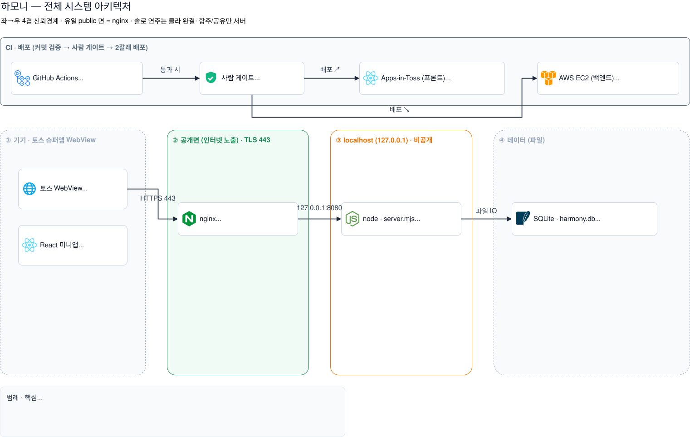
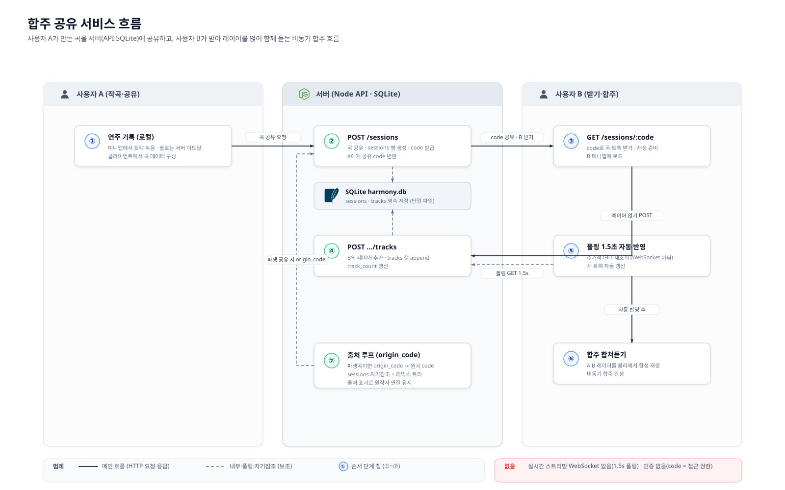
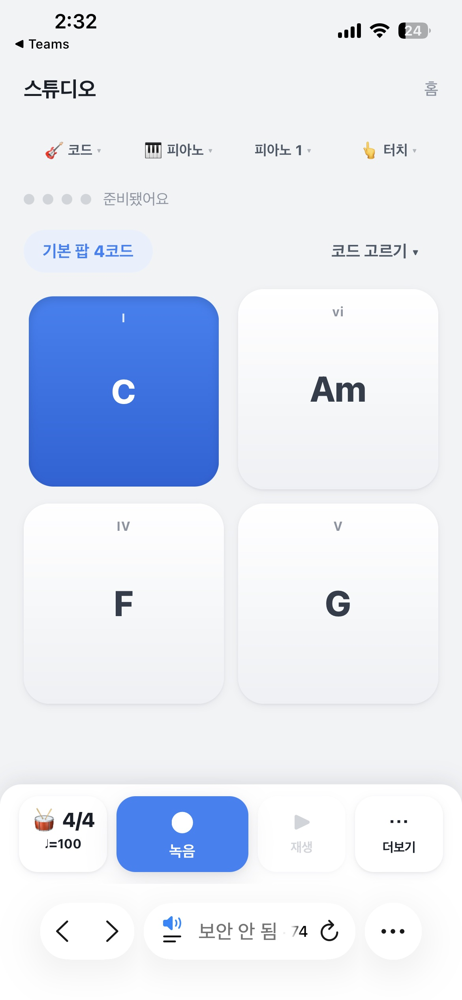
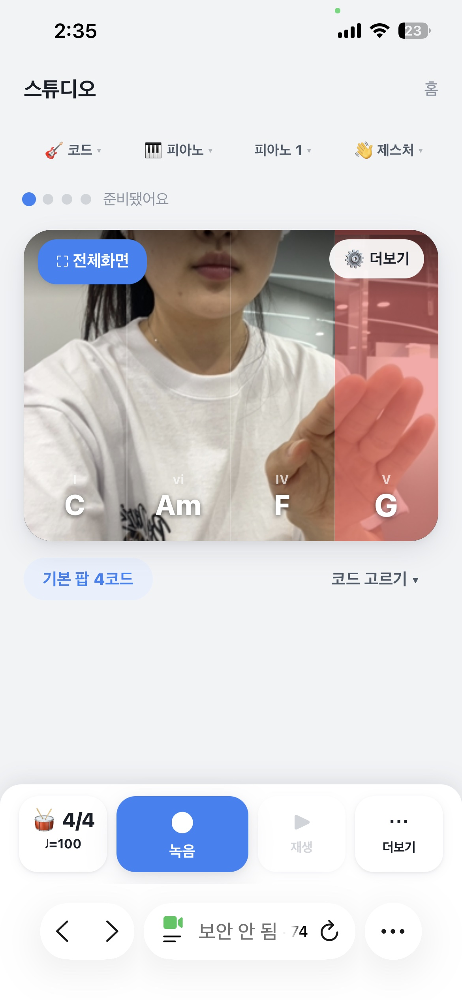
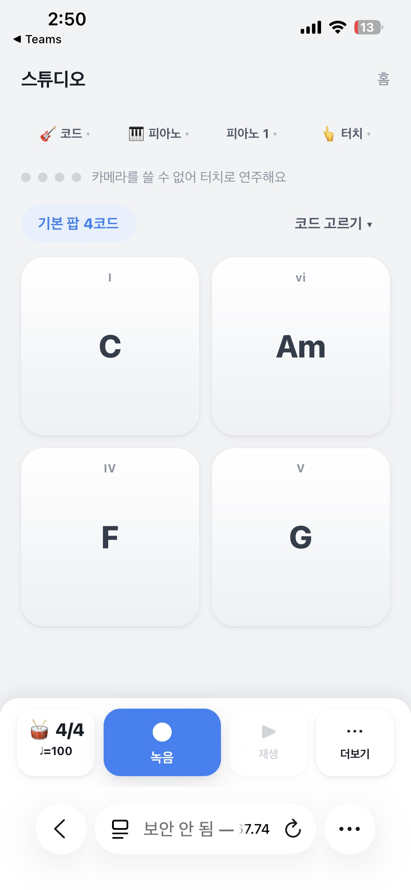
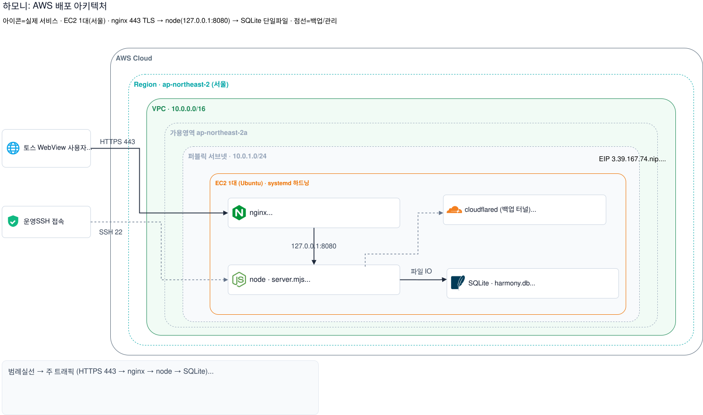

<!--
이 파일은 디자인 적용(클로드 디자인)용 원본 콘텐츠다.
- 모든 수치·날짜는 저장소 실제 산출물·소스 기준이며 임의로 바꾸지 않는다.
- 가운뎃점(·)·쉼표를 쓰고, 줄표(긴 대시)는 쓰지 않는다.
- 이미지 경로는 이 파일 위치(산출물/99_제출파일/) 기준 상대경로다. 디자인 시 같은 파일을 첨부해 배치한다.
- <!-- 디자인: ... --> 주석은 레이아웃 힌트다(렌더에는 보이지 않음).
-->

<!-- 디자인: 표지. 좌측 브랜드(하모니/Harmony) + 우측 미니앱 목업(C·Am·F·G 코드 패드 2개), 토스 블루 카드. 하단 4개 정보 카드. -->

# 하모니 Harmony

### Apps in Toss 출품 프로젝트 · 비동기 합주·음원 공유 미니앱 개발

# 앱 개발 종료보고서

개발 결과, 산출물, 품질 검증, 운영 및 향후 계획 정리

| 개발 기간 | 회의 | 구성 | 배포 |
|---|---|---|---|
| 2026.06.19 ~ 06.26 | 제1차 ~ 제7차 | 화면 7 · API 10 | 앱인토스 정식 출시 완료 |

문서번호 HARMONY-CLOSE-2026 · 하모니 프로젝트팀 · 이상혁 · 양록빈 · 김민혁 · 곽소정 · 2026.06.26

---

## 문서 정보 · 개발 종료보고서 개요

본 문서는 하모니 앱 개발 종료 시점의 개발 결과, 산출물, 테스트 및 운영 계획을 정리한 종료보고서다. 제1차부터 제7차까지의 회의 의사결정과 프로그램 목록, 사용자 매뉴얼 화면, 별도 산출물(테스트 계획서·결과서, 시스템 구성도, 기능정의서 등)을 반영해 작성했다.

| 항목 | 내용 |
|---|---|
| 문서명 | 하모니(Harmony) 앱 개발 종료보고서 |
| 문서번호 | HARMONY-CLOSE-2026 |
| 프로젝트명 | 하모니 Harmony · 비동기 합주·음원 공유 미니앱 개발 프로젝트 |
| 개발 기간 | 2026.06.19 ~ 2026.06.26 (7일) |
| 소속·팀 | 하모니 프로젝트팀 (4인) |
| 참여 인원 | 이상혁(조장) · 양록빈 · 김민혁 · 곽소정 |
| 배포 기준 | 앱인토스 출품 및 토스 미니앱 운영 환경 기준 |
| 작성 기준 자료 | 회의록 제1차~제7차, 프로그램 목록, 사용자 매뉴얼, 기능정의서, 시스템 구성도, 테스트 계획서·결과서, WBS 및 발표자료 |

<!-- 디자인: 아래 4개 숫자 카드(큰 숫자 + 라벨). -->

| 화면 | API | 공통 모듈 | 스튜디오 컴포넌트 |
|---|---|---|---|
| **7개** 온보딩·홈·스튜디오·커뮤니티·설정 등 | **10개** 세션·트랙·댓글·좋아요·신고 | **10개** 오디오·제스처·편집·저장 | **6개** 코드 매트릭스·패드·프렛보드 |

> **종료 판단**: 2026.06.26 최종 점검 회의(제7차)에서 하모니 앱의 주요 기능 정상 동작, 발표 시연 준비, 산출물 이상 여부 확인 및 앱인토스 배포 완료를 확인했으므로 본 프로젝트를 개발 종료 상태로 정리한다. 프로그램 구성요소 개수는 본 보고서의 제출용 집계 기준으로 총 33개이며, 상세는 프로그램 목록·프로그램 설계서를 참조한다(소스 파일 단위 카운트와 버킷팅이 다를 수 있음).

---

## 보고서 구성

| 구분 | 장 | 내용 |
|---|---|---|
| 01 | 프로젝트 개요 | 개발 배경, 목적, 범위, 종료 기준 |
| 02 | 추진 경과 | 회의별 핵심 의사결정 및 일정 흐름 |
| 03 | 개발 결과 | 주요 기능, 화면 구성, 사용자 흐름 |
| 04 | 개발 환경 | 기술 스택, 시스템 구성, 프로그램 목록 |
| 05 | 산출물 내역 | 산출물 구분 및 상태 |
| 06 | 테스트 및 품질 검증 | 단위·통합·보안·실기기 검증 결과 |
| 07 | 배포 결과 및 운영 | AWS 배포, 토스 출시, 운영 및 향후 계획 |
| 08 | AI 개발 파이프라인 | 3에이전트 구조, 사람 검토 사례, 재사용 자산 |
| 09 | 참여 인력 및 업무 분장 | 담당자별 역할과 기여 |
| 10 | 프로젝트 회고 및 소감 | 팀 회고, 참여자 소감 |
| 부록 | 회의록 핵심 의결 요약 | 제1차~제7차 의결 사항 |

---

## 01. 프로젝트 개요

<!-- 디자인: 3개 컬럼 카드(BACKGROUND / PURPOSE / VALUE). -->

| BACKGROUND · 개발 배경 | PURPOSE · 개발 목적 | VALUE · 핵심 가치 |
|---|---|---|
| 짧은 개발 기간 안에서 사용자가 즉시 체험할 수 있고, 공유를 통해 확장되는 미니앱을 목표로 했다. 초기 아이디어 검토 후 악용 가능성과 심사 리스크를 낮추고 창작 경험을 강조하는 방향으로 전환했다. | 토스 미니앱 환경에서 코드·멜로디·드럼을 간단히 연주하고 녹음한 뒤, 다른 사용자의 트랙 위에 새 음을 얹어 비동기 합주를 완성하는 경험을 제공한다. | 가입 없이 닉네임과 익명 식별만으로 시작하고, C·Am·F·G 중심의 쉬운 코드 패드와 터치·제스처 입력으로 음악 제작 진입 장벽을 낮춘다. |

| 항목 | 내용 |
|---|---|
| 서비스 정의 | 하모니는 사용자가 악기와 스타일을 선택해 코드 또는 멜로디를 연주하고, 녹음한 트랙을 커뮤니티에 공유하거나 타인의 트랙에 레이어를 추가하는 비동기 합주 미니앱이다. |
| 주요 사용자 | 토스 미니앱 환경에서 회원가입 없이 짧은 음악을 만들고 공유하려는 사용자, 친구와 한 곡을 함께 완성하려는 사용자 |
| MVP 범위 | 온보딩, 홈, 스튜디오, 코드 선택, 연주·녹음·재생, 커뮤니티 공유, 세션 불러오기, 레이어 추가, 댓글·좋아요·신고, 설정 |
| 제외·비목표 | 초기 소모임 밋업·공개 사용자 모집형, 실시간 스트리밍 합주, 트랙 믹싱·볼륨 조절, 친구 초대 협업, Google Play·App Store 등록, 멀티 AZ·ALB·RDS 같은 고가용 인프라는 이번 범위에서 제외했다. |
| 종료 기준 | 기능정의서와 프로그램 목록 기준 핵심 기능 구현, 산출물 정리, 테스트 결과 이상 없음 확인, 앱인토스 배포 완료 |

> 초기 주제는 오프라인 소모임 밋업이었으나 2026-06-21 악기 합주 앱으로 전환했다(의사결정 기록 DL-018). 공개 사용자 모집형이 가진 정책·심사 리스크를 줄이고 창작·공유 경험에 집중하기 위한 제품 결정이었다.

---

## 02. 추진 경과 및 주요 의사결정

회의는 개최일 기준 제1차부터 제7차까지로 정리했으며, 아이디어 선정부터 개발·테스트·배포까지 단기간에 반복 검토 방식으로 진행했다. 회의에는 4인 전원(이상혁·양록빈·김민혁·곽소정)이 참석했다.

<!-- 디자인: 가로 타임라인. 06.19 ~ 06.26 노드 7개. -->

| 06.19 | 06.21 | 06.22 | 06.23 | 06.24 | 06.25 | 06.26 |
|---|---|---|---|---|---|---|
| 아이디어 선정 | 방향 전환 | 기능 구조 | 합주·산출물 | 업무 분담 | 최신화 | 종료·배포 |
| 6안 도출 후 1차 선정 | 하모니 비동기 합주로 확정 | 악기 4종·스타일 8종 | WBS·산출물 확정 | 수정·테스트·배포 준비 | 매뉴얼·화면정의서 | 정상 동작 확인 및 출시 |

### 단계별 일정 흐름

| 구간 | 단계 | 정리 내용 |
|---|---|---|
| 6/19~6/20 | 착수·기획 | 과제 요구사항 정리, 역할 확정, 아이디어 브레인스토밍. 초기 밋업 기준 기획은 주제 전환으로 폐기하고, 멀티에이전트 하네스·디자인 시스템·스캐폴드는 재사용했다. |
| 6/21~6/22 | 주제 전환·코어 악기 엔진 | 악기 합주 앱 「하모니」로 전환(DL-018), 카메라 손 제스처 핸드트래킹 검증(커밋 923e545), 코드·멜로디·드럼 엔진 구현 |
| 6/23 | 합주·풀스튜디오 | 멀티트랙 레이어, 구간 반복, 음 편집, 코드 기반 비동기 합주 공유 |
| 6/24 | AWS 배포·HTTPS·실기기 | EC2·nginx·systemd·certbot 구성, 정적 앱과 API 동일 도메인 서빙, 실기기 회귀 |
| 6/25 | 토스 등록·변경 최소화 | appName을 harmony로 교체, 토스 콘솔 정식 등록·심사 제출 |
| 6/26 | 제출·발표·출시 | 14:00 발표·시연, 테스트 트랙 출시(버전 20260626-1)에 이은 정식 전체공개(프로덕션) 출시 완료 |

크리티컬 패스는 주제 전환 합의(DL-018) → 코어 악기 엔진 → 합주 → 풀스튜디오 → AWS 배포·HTTPS → 토스 등록·출시 → 실기기 검수 → 발표(6/26 14:00) → 출시 후 점검·제출 순이었다.

### 주요 의사결정

| 번호 | 일자 | 요지 | 상태 |
|---|---|---|---|
| DL-016 | 2026-06-21 | 토스 로그인 제외, 익명 식별키(getAnonymousKey) 채택, 사업자 미등록 | Approved |
| DL-018 | 2026-06-21 | 주제 전환: 소모임 밋업 → 악기 합주 미니앱 「하모니」 | 팀 합의(Proposed) |
| DL-019 | 2026-06-21 | 하모니 MVP 최종 스펙(제스처 기본 + 터치 폴백, 라우트 축소, AWS + SQLite 백엔드) | Approved |
| DL-021 | 2026-06-22 | 하모니 백엔드 AWS 배포, 미니앱은 6/25 등록·심사 제출 후 6/26 출시 완료 | Approved |
| DL-022 | 2026-06-22 | 스코프 확대: 축소 MVP에서 풀버전으로 복귀, 앱을 동일 도메인에서 서빙 | Approved(조장 권한) |

> 개발 종료 시점의 핵심 판단은 "정상 동작 가능한 MVP를 배포하고, 운영 가능한 커뮤니티·신고·숨김 구조를 갖추었는가"로 설정했다.

---

## 03. 개발 결과 · 주요 기능

<!-- 디자인: 6개 기능 카드(01~06). 가능하면 각 카드에 대응 앱 캡처 썸네일. -->

| 번호 | 기능 | 설명 |
|---|---|---|
| 01 | 가입 없이 바로 시작 | 닉네임만 입력하면 시작하고, 익명 식별키를 토스 getAnonymousKey 또는 브라우저 난수(crypto 128bit)로 발급한다. 회원가입·로그인이 없어 진입 장벽을 낮췄다. |
| 02 | 코드·멜로디·드럼 연주 | 7루트 × 4종류(maj·m·7·m7) 28코드, 피아노 멜로디 건반, 드럼 패드, 기타·베이스 크로매틱 계이름 패드를 악기 4종(피아노·기타·베이스·드럼)과 스타일 2종씩으로 연주한다. |
| 03 | 터치·제스처 입력 | 터치 입력을 기본으로 하고, 카메라 기반 손 제스처 연주(MediaPipe 양손 추적)를 선택적으로 제공한다. 손 흔들기·박수·헤드뱅잉을 효과음으로 낸다. 카메라 실패 시 터치로 폴백한다. |
| 04 | 녹음·재생·편집 | 녹음한 결과를 재생바(스크럽·재생·일시정지)로 듣고, 피아노롤 에디터에서 위치·길이·조옮김·퀀타이즈를 편집한다. |
| 05 | 비동기 합주 | 연주를 서버에 올려 공유 코드를 받고, 코드로 친구 트랙을 불러와 내 레이어를 얹는다. 약 1.5초 폴링으로 새 트랙을 반영한다(실시간 스트리밍 아님). |
| 06 | 커뮤니티 운영 | 공개곡 보드에서 좋아요(서버 집계)·댓글·신고·가져오기, 내 곡 올리기를 제공한다. 신고 누적 자동 숨김으로 운영 안전을 확보했다. |

**그림 1. 스튜디오 제스처 모드 · 카메라로 손을 비춰 C·Am·F·G 코드를 연주한다.**

**그림 2. 멜로디 모드 · 피아노 건반으로 멜로디를 연주한다.**

### 사용자 흐름

<!-- 디자인: 가로 플로우(스플래시 → 온보딩 → 홈 → 스튜디오 → 커뮤니티 → 설정). -->

스플래시(약 1.3초 브랜드 리빌) → 온보딩(닉네임·익명키 발급) → 홈(최근 곡) → 스튜디오(연주·녹음) → 커뮤니티(공유·합주) → 설정(프로필·공지).

스튜디오 화면은 상단 선택 영역(연주법·악기·스타일·입력 방식), 중앙 연주 패드, 하단 컨트롤(메트로놈·녹음·재생·더보기)을 중심으로 구성했다. 처음 사용하는 사용자는 기본 패드를 한 번 눌러 소리를 켜고, 필요에 따라 코드 고르기와 더보기 기능을 확장 사용한다.

---

## 03-1. 화면 구성 및 UI/UX 결과

토스 디자인 시스템(TDS)의 색·컴포넌트 규칙을 기준으로 푸른 메인 컬러, 여백이 넓은 카드형 UI, 둥근 버튼과 연한 회색 패널을 적용했다. 다만 미니앱 WebView 제약으로 일부 토큰은 자체 토스풍 theme.css로 대체했다(TDS 부분 적용). 사용자 매뉴얼 화면과 실제 앱 화면을 동일한 기준으로 정리했다.

<!-- 디자인: 아래 4장을 2x2 그리드로. -->

**그림 3. 온보딩 · 닉네임 입력 후 익명키 발급, 가입·로그인 없는 즉시 시작.**

**그림 4. 스튜디오 · 악기·스타일·입력 선택, 코드·멜로디·드럼 연주, 녹음·합주.**

**그림 5. 코드 직접 고르기 · 7×4 코드표에서 최대 6개 선택, 선택한 코드가 패드에 반영.**

**그림 6. 커뮤니티 · 공개곡 보드, 좋아요·댓글·신고·가져오기, 내 곡 올리기.**

| 화면 | 구현 결과 |
|---|---|
| 스플래시·온보딩 | 브랜드 리빌 후 닉네임 입력, 익명키 발급. 가입·로그인이 아닌 즉시 시작 구조. |
| 홈 | 인사 화면, 최근 곡 이어하기 목록, 앱 진입 후 자연스러운 재방문 흐름 제공. |
| 스튜디오 | 악기·스타일·입력 선택, 코드·멜로디·드럼·제스처 연주, 녹음·합주·편집·레이어 관리. |
| 코드 선택 | maj·m·7·m7 코드표에서 최대 6개 선택, 선택한 코드가 색상으로 패드에 반영. |
| 커뮤니티 | 공개곡 보드, 들어보기, 좋아요·댓글·신고, 가져오기·합주 올리기. |
| 설정 | 이미지 프로필, 닉네임, 개발자 모드, 버전, 법적 고지(초안). |

---

## 04. 개발 환경 및 기술 스택

프로그램 목록과 회의록에 명시된 실제 소스 구조 기준으로 정리했다. 상세 버전 정보는 별도 기능정의서·시스템 구성도·소스 저장소를 기준으로 관리한다.

| 영역 | 구성 | 내용 |
|---|---|---|
| 프론트엔드 | `apps/miniapp` | React 18 + TypeScript + Vite 6 + Granite(@apps-in-toss/web-framework 2.9.2) + TDS 일부(@toss/tds-mobile, 일부 토큰은 자체 theme.css). 공통 셸·라우터, 스튜디오·커뮤니티·설정, 오디오·제스처·편집 모듈 |
| 백엔드 API | `apps/api/server.mjs` | Node 내장 `node:http` + `node:sqlite` + `node:crypto` 무외부의존 API 서버. 세션·트랙·댓글·좋아요·신고·숨김 처리 |
| 데이터 저장 | SQLite + localStorage | 공유 세션·커뮤니티 데이터는 서버 SQLite(5테이블), 개인 솔로 곡·닉네임·익명키·이모지·설정은 브라우저 localStorage |
| 오디오 | Tone.js 엔진·트랜스포트 | 코드·멜로디·드럼 발음, 샘플·합성 전환 스케줄, BPM·박자·메트로놈 tick 변환. 라이브 지연 축소 위해 lookAhead 0.02초 |
| 제스처 | MediaPipe(@mediapipe/tasks-vision) | 손 추적 기반 제스처 인식(HandLandmarker 양손), 얼굴 인식(FaceDetector), 카메라 실패 시 터치 입력 폴백 |
| 운영·보안 | 익명 식별·신고·숨김 | 토스 익명키, 닉네임·이모지 프로필, 중복 댓글 방지, 신고 누적 자동 숨김, 운영용 숨김 처리 |

| 개발 관리 방식 | 회의별 결정사항을 WBS와 산출물 목록에 반영하고, 짧은 일정에 맞춰 MVP 우선순위를 적용했다. |
|---|---|
| 품질 기준 | 핵심 기능 정상 동작, 화면 흐름 일관성, 저장·공유·합주 데이터 흐름, 신고·댓글 등 커뮤니티 운영 기능 검증 |
| 제약 조건 | 6/26 배포 마감, 앱인토스 미니앱 환경, 모바일 화면 차이, 카메라·제스처 입력 안정성, 사용자 생성 콘텐츠 운영 리스크 |

---

## 04-1. 시스템 구성도

하모니는 사용자 단말의 토스 미니앱 화면에서 연주 이벤트를 생성하고, 로컬 저장 또는 서버 세션으로 저장·공유하는 구조로 설계했다. 솔로 연주는 클라이언트에서 완결되고, 합주·커뮤니티 공유만 서버를 거친다.

**그림 7. 전체 시스템 아키텍처 · 신뢰경계 4겹(기기 → nginx 443 → 127.0.0.1:8080 → SQLite), 솔로는 클라이언트 완결, 합주·공유만 서버.**

**그림 8. 합주 공유 서비스 흐름 · 연주 기록 → 공유(코드) → 받기·레이어 → 폴링·합주 → 출처 크레딧.**

시스템 구성의 핵심은 스튜디오에서 생성되는 연주 이벤트(NoteEvent)를 일관된 이벤트 계약으로 정규화한 뒤, 로컬 재생·편집·저장 또는 서버 세션·트랙 데이터로 연결하는 것이다. 커뮤니티는 공개 세션 목록을 조회하고, 사용자가 가져오기 또는 합주 올리기를 통해 기존 트랙 위에 새로운 레이어를 추가하도록 구성했다.

| 구분 | 구성 요소 |
|---|---|
| 입력 | 터치 패드, 피아노·드럼·기타·베이스 UI, 카메라 제스처 |
| 이벤트 처리 | 코드 리듀서(chordReducer), 이벤트 계약(events), 음정 변환·음 편집 로직 |
| 오디오 실행 | 오디오 엔진, 트랜스포트, 메트로놈, 샘플 스케줄 |
| 저장·공유 | localStorage 솔로 곡 저장, POST /sessions 트랙 업로드, 6자리 코드 발급 |
| 커뮤니티 운영 | GET /community, 댓글·좋아요, 신고 누적 자동 숨김, 운영용 숨김 |

데이터 흐름: 연주(터치·제스처) → 코드 리듀서 tick 이벤트 → 로컬 저장 또는 서버 공유(POST /sessions 코드 발급) → 친구가 코드로 조회(GET /sessions/:code) → 내 레이어 얹기(POST .../tracks) → 약 1.5초 폴링 반영 → 세션 전체 트랙을 트랙별 음색으로 합주 재생.

---

## 04-2. 프로그램 목록 요약

프로그램 목록은 프로그램 설계서와 함께 관리하며, 본 보고서의 제출용 집계 기준으로 총 33개 프로그램이다(소스 파일 단위 카운트와 버킷팅이 다를 수 있음).

| 분류 | 수량 | 주요 항목 |
|---|---|---|
| 화면(apps/miniapp 라우트) | 7 | 스플래시·온보딩·홈·스튜디오·코드 선택·커뮤니티·설정 |
| 서버 API(apps/api/server.mjs) | 10 | 헬스 체크, 커뮤니티 목록, 세션 생성·조회, 트랙 얹기, 댓글 조회·작성·신고, 좋아요 토글, 세션 숨김 |
| 공통 모듈(핵심 로직) | 10 | 오디오 엔진, 코드 리듀서, 이벤트 계약, 트랜스포트, 제스처 인식, 음정 변환, 음 편집, 합주 클라이언트, 로컬 저장, 익명 식별 |
| 스튜디오 컴포넌트 | 6 | 코드 매트릭스, 악기·스타일 콤보, 계이름 패드, 드럼 패드, 음 편집기, 제스처 프렛보드 |

### API 프로그램 목록

`apps/api/server.mjs`의 실제 라우트 기준이다(메서드 + 경로 조합 10개). 인증은 없고 비공개 세션은 6자리 코드가 접근 자격이며, 식별은 클라이언트 익명키와 닉네임을 사용한다.

| ID | 메서드·경로 | 설명 |
|---|---|---|
| PG-API-001 | GET /healthz | 서버 상태 확인(`{ok, time}` 반환) |
| PG-API-002 | GET /community | 커뮤니티 보드 목록(공개·미숨김, 최신순, 커서 페이지네이션) |
| PG-API-003 | POST /sessions | 세션 생성·게시(콘텐츠 중복 방지, 출처 강제, 멱등 토큰) |
| PG-API-004 | GET /sessions/:code | 세션 상세 조회(트랙·좋아요 수, 재생수 증가) |
| PG-API-005 | POST /sessions/:code/tracks | 트랙 얹기(공개 세션은 소유자만, 최대 16트랙) |
| PG-API-006 | GET /sessions/:code/comments | 댓글 목록(미숨김, 최신순 100건) |
| PG-API-007 | POST /sessions/:code/comments | 댓글 작성(텍스트 정화·개인정보 차단, 60초 중복 무시) |
| PG-API-008 | POST /sessions/:code/comments/:id/report | 댓글 신고(신고자당 1회, 3건 누적 시 자동 숨김) |
| PG-API-009 | POST /sessions/:code/like | 좋아요 토글(익명키당 1회, `{liked, count}` 반환) |
| PG-API-010 | POST /sessions/:code/hide | 작성자 본인 세션 숨김(소유자 검증) |

> 상세 프로그램 목록 원본은 별도 산출물(프로그램 목록·프로그램 설계서)로 관리하고, 본 보고서에는 종료 판단에 필요한 요약만 반영했다.

---

## 05. 산출물 내역

개발 종료 시점의 산출물은 기획, 설계, 개발, 테스트, 운영·발표 자료로 구분해 정리했다.

| 구분 | 산출물 | 상태 | 비고 |
|---|---|---|---|
| 회의록 | 제1차~제7차 회의록(PDF 7건 + 통합 Word) | 완료 | 아이디어 선정, 방향 전환, 기능 확정, 업무 분담, 배포 점검 이력 |
| 기획·요구 | 요구사항 정의서, 기능정의서 | 완료 | MVP 기능 범위, 사용자 시나리오, 기능별 상세 정의 |
| 설계 | 화면정의서, 시스템 구성도, 아키텍처 문서 | 완료 | 화면 흐름, API·DB·모듈 구성, 시스템 구조 |
| 디자인 | 디자인 명세서, 와이어프레임, 목업, 로고 | 완료 | 카드형 UI, 블루 컬러 시스템, 사용자 매뉴얼 화면 반영 |
| 개발 | 소스코드, 프로그램 목록 | 완료 | 화면 7, API 10, 공통 모듈 10, 컴포넌트 6 |
| 테스트 | 테스트 계획서, 테스트 결과서, 테스트 커버리지 | 완료 | 단위·통합·UI·운영 기능 검증, 수정 이슈 반영 |
| 배포·발표 | 사용자 매뉴얼, 최종 발표자료, 종료보고서 | 완료 | 앱인토스 배포 및 발표 시연용 최신본 정리 |

| 산출물 관리 원칙 | 구현 내용 변경 시 화면정의서와 사용자 매뉴얼을 최신화하고, 테스트 결과서에 수정·재검증 이력을 반영한다. |
|---|---|
| 인수인계 관점 | 앱인토스 운영 환경, API 목록, 화면 흐름, 테스트 결과, 알려진 제약을 중심으로 후속 유지보수가 가능하도록 정리한다. |
| 종료 보고 범위 | 개발 종료보고서는 최종 발표자료가 아니라 개발 완료 상태의 증빙 문서이므로 성과·산출물·테스트·운영 계획 중심으로 작성한다. |

---

## 06. 테스트 및 품질 검증

별도 테스트 계획서·결과서를 기준으로 핵심 사용자 흐름, 모듈 로직, 커뮤니티 운영 기능, 모바일 화면 대응을 점검했다. 수치는 단위·통합 테스트 결과서(승인본) 기준이다.

| 구분 | 검증 대상 | 결과 |
|---|---|---|
| 단위 테스트 | 코드 리듀서, 이벤트 계약, 트랜스포트, 음정 변환, 음 편집 로직 | **58/58 통과**, 결함 0 |
| 통합 테스트 | 연주 → 녹음 → 저장 → 세션 발행 → 커뮤니티 조회 → 트랙 얹기 | **34/34 성공**, 결함 0 |
| 보안 블랙박스 | IDOR 차단, 소유자 허용, 신고 키회전 우회, 멱등 재생, 숨김 직접 접근, 익명키 반영, 헤더 위조 레이트리밋 | **7/7 통과**(통합 34건에 포함) |
| 타입체크·빌드 | `tsc --noEmit`, `vite build` | 타입 0 errors, 빌드 PASS |
| 실기기 검수 | 소리·카메라·2기기 합주 | **9건 육안 성공** |

### 세부 수치

- **단위 테스트**: vitest로 순수 로직 7개 파일 58케이스 전부 통과(58/58). 내역은 chordReducer(15)·chordReducer.poly(6)·tuning(12)·events(8)·loop(6)·noteEdit(6)·notes(5). 환경 Windows 11, Node v24.16.0, 커밋 c13b818, 실행 2026-06-25.
- **통합 테스트**: 34/34 성공(API 12 + 보안 7 + 클라이언트 6 + 실기기 9). API·보안·클라이언트 22건은 헤드리스(curl·블랙박스), 실기기 9건은 토스 샌드박스 실기기 육안 확인. 재실행 2026-06-25, 커밋 c13b818.
- **타입체크·웹 빌드**: 타입체크 `tsc --noEmit` 0 errors, 웹 빌드 `build:web` PASS(1016 modules, dist js 598.90 kB / gzip 172.88 kB).
- **실기기 검수**: 토스 샌드박스 아이폰 13·갤럭시 S23 Ultra에서 이상혁·양록빈이 육안으로 직접 확인. 통합 IT-RT 9건과 기본 UX 흐름 6건을 포함해 RT 15건 전부 실기기 확인. 증빙 스크린샷 9장(EV-201~209)을 보관했다.

**그림 9. 실기기 검수 · 터치로 코드를 눌러 소리가 재생된다(아이폰 13·갤럭시 S23 Ultra).**

**그림 10. 실기기 검수 · 카메라 권한 허용 후 손을 인식해 C·Am·F·G 코드를 연주한다.**

**그림 11. 실기기 검수 · 카메라를 쓸 수 없을 때 터치 입력으로 폴백한다.**

| 품질 항목 | 결과 | 근거 |
|---|---|---|
| 주요 기능 정상 동작 | 완료 | 제7차 최종 점검에서 하모니 앱 기능 및 실행 상태 정상 확인 |
| 산출물 최신화 | 완료 | 화면 캡처, 화면정의서, 사용자 매뉴얼, 발표 자료 최신본 반영 |
| 이슈 수정 | 완료 | 신고 자동 삭제, 기타 음 동일 출력, 멜로디 제스처, 화면 차이 등 수정 반영 |
| 배포 상태 | 완료 | 앱인토스 배포 기준 최종 버전 확정 |

> 테스트 결과서(단위·통합)는 승인본이며 실측 일자·커밋과 함께 기록돼 있다. 테스트 종합보고서는 검토 단계에 있고, 후속 운영 중 발견되는 오류는 배포 후 유지보수 이슈로 관리한다.

---

## 06-1. 주요 이슈 및 해결 방안

회의록에 기록된 개발 이슈를 중심으로 원인, 조치, 종료 시 상태를 정리했다.

| 이슈 | 내용 | 해결 방안 | 상태 |
|---|---|---|---|
| 아이디어 악용 가능성 | 초기 보이스피싱 훈련 앱이 악용 가능성으로 앱인토스 취지와 맞지 않는다고 판단 | 아이디어를 하모니 비동기 합주·음원 공유로 전환 | 해결 |
| 제스처 구현 리스크 | 짧은 기간 내 카메라 기반 인터랙션 구현 가능성 불확실 | 사전 기술 검토 후 MediaPipe 적용, 카메라 실패 시 터치 폴백 설계 | 해결 |
| 코드 선택 제한 | 기본 4개 코드 고정으로 사용자 확장성 부족 | 7×4 코드표와 최대 6개 선택 방식 추가 | 해결 |
| 코드 음 혼동 | 코드 구성음이 얇게 들려 사용자가 음을 구분하기 어려움 | 근음 더블링 방식으로 발음 개선 | 해결 |
| 녹음 화면 초상권 | 화면 녹화 방식은 사용자 얼굴·주변 노출 위험 | 화면 녹화 제외, 음원만 저장하는 구조로 변경 | 해결 |
| 신고 누적 자동 삭제 | 신고 3~4회 누적 시 게시글 자동 숨김이 정상 동작하지 않음 | 관리자 페이지 로직 및 신고 누적 조건 재검증(임계 3건) | 해결 |
| 기종별 화면 차이 | 모바일 기기별 화면 크기 차이로 UI 깨짐 가능성 | 화면정의서 최신화, 반응형 UI 보정, 실제 화면 캡처 교체 | 해결 |
| 기타 음 동일 출력 | 기타 칸별 소리가 동일하게 출력됨 | 칸별 다른 소리 매핑 및 멜로디 모드 UI·제스처 보완 | 해결 |
| 합주 음색·번들 | 합주 듣기 시 일부 트랙 합성 폴백, 프로덕션 JS 단일 청크 | 외부 샘플·코드 스플리팅은 후속 과제로 관리 | 후속 |

### 잔여·미해결 항목

배포 후에도 남아 있는 한계와 후속 과제를 출시 판정서·정책준수표 기준으로 정직하게 정리한다.

| 항목 | 내용 | 상태 |
|---|---|---|
| TDS 부분 적용 | TDS 색·컴포넌트 규칙을 기준으로 하되 미니앱 WebView 제약으로 일부 토큰은 자체 theme.css로 대체 | 부분 적용 |
| 신고 모더레이션 통지 | 신고 누적 자동 숨김 시 작성자에게 별도 통지하지 않음(shadow moderation) | 후속 |
| 정책 항목 일부 미구현 | 연령 확인 등 일부 정책 항목 미구현(비사업자·데모 운영 범위) | 후속 |
| 종합 검증 재측정 | 산출물 누락 해소 후 `검증_전체 --strict` 종합 재측정 미실행(Not Run) | 권장 |
| 외부 샘플·합주 음색 | 외부 오디오 샘플 CDN 미연동 시 합성 폴백, 토스 WebView CSP 영향 가능 | 후속 |
| 프로덕션 번들 | JS 단일 청크로 빌드, 코드 스플리팅 미적용 | 후속 |

> 교훈: 짧은 기간의 미니앱 개발에서는 기능을 늘리는 것보다 리스크가 큰 기능을 조기에 확인하고, 개인정보·커뮤니티 운영·기기 호환성처럼 배포 후 문제가 될 수 있는 요소를 선제적으로 줄이는 것이 중요하다.

---

## 07. 배포 결과 및 운영

### 백엔드 (AWS)

하모니 백엔드는 AWS Ubuntu 서버에 배포 완료했다. 운영 환경은 Ubuntu 26.04, Node 24.17이다. API는 `node:http` + `node:sqlite` 무외부의존 구성으로, systemd 서비스 `harmony-api`(포트 8080)로 구동된다. 외부 접근은 nginx 리버스프록시가 TLS로 종단하며, 인증서는 certbot.timer로 자동 갱신한다. HTTP 80은 HTTPS로 리다이렉트하고, AWS 보안그룹은 80·443 포트를 연다.

운영 도메인은 `https://3.39.167.74.nip.io`(nip.io + Let's Encrypt)이며, 한 도메인에서 정적 미니앱(`/opt/harmony-web`)과 API를 함께 서빙한다. 라이브 헬스체크는 `/healthz`에서 HTTP 200, `{"ok":true}`로 기록돼 있다. 솔로 연주는 클라이언트에서 완결되고 합주·커뮤니티만 서버를 거친다.

**그림 12. AWS 배포 아키텍처 · 단일 AZ EC2 1대에 nginx·node·sqlite·systemd 구성(멀티 AZ·ALB·RDS는 범위 밖).**

### 토스 출시

토스 앱마켓(앱인토스)에 미니앱 「하모니」(appName harmony)를 정식 등록(2026-06-25, 등록 담당 곽소정)하고 심사 제출까지 마쳤다. 이후 2026-06-26 13:50 버전 `20260626-1`(SDK 2.9.2)이 테스트 트랙으로 출시돼 콘솔 '앱 출시' 상태가 "현재 출시됨"으로 표시됐고, 같은 날 2026-06-26 정식 전체공개(프로덕션) 출시가 완료됐다. 출시 판정서의 토스 출시 판정은 Go이며, 조장 이상혁이 2026-06-26 Go 승인했다. 미니앱 코드 `granite.config.ts`의 appName을 harmony로 교체해 콘솔 등록값과 일치시켰다(이전 임시 식별자 불일치 해소).

| 항목 | 값 |
|---|---|
| 앱명(표시) | 하모니 |
| 앱 ID(appName) | harmony |
| 부제 | 악기 없이도 함께하는 합주 |
| 카테고리 | 생활 > 일상 > 취미 |
| 검색 키워드 | 밴드·피아노·음악·기타·베이스·드럼·취미·악기 |
| 고객문의 이메일 | kljl6773@gmail.com |
| 서비스 유형 | 비게임 미니앱 |
| 사용자 식별 | getAnonymousKey(익명) + 닉네임 |
| 요청 권한 | 카메라(손 제스처 연주) |
| 사업자 등록 | 미등록(비사업자) |
| 운영 백엔드 | https://3.39.167.74.nip.io (AWS, HTTPS) |

> 앱인토스 배포 완료 가산점(10%)은 2026-06-26 정식 전체공개(프로덕션) 출시로 조건이 충족됐다고 기록돼 있다. 토스 앱 내 실행이 가능하며, 최종 인정 여부는 평가자 판단에 따른다.

### 운영 방안

| 항목 | 운영 방안 |
|---|---|
| 배포 채널 | 앱인토스 출품 및 토스 미니앱 환경에서 접근 가능한 형태로 운영한다. 별도 Google Play / App Store 등록 정보는 본 보고서 범위에서 제외한다. |
| 운영 데이터 | 공유 세션·트랙·댓글·좋아요·신고 상태는 서버 API와 SQLite 기준으로 관리하고, 개인 솔로 곡은 localStorage 저장 구조를 유지한다. |
| 콘텐츠 관리 | 댓글 중복 방지, 신고 누적 자동 숨김, 운영용 게시물 숨김 기능을 통해 커뮤니티 게시물을 관리한다. |
| 유지보수 | 배포 후 발견되는 화면 깨짐, 오디오 지연, 제스처 인식 실패, 공유 세션 오류는 이슈 단위로 기록하고 우선순위에 따라 수정한다. |
| 사용자 지원 | 사용자 매뉴얼, 설정 화면의 버전·법적 공지, 커뮤니티 신고 기능을 통해 기본 안내와 문제 대응을 제공한다. |

### 향후 업데이트 계획

| 구분 | 향후 업데이트 계획 |
|---|---|
| 단기 | 모바일 화면 안정화, 제스처 보정, 기타·베이스 음색 세분화, 댓글·신고 운영 화면 개선 |
| 중기 | 악기·스타일 확장, 음 편집 기능 강화, 합주 트랙 믹싱·볼륨 조절, 커뮤니티 탐색·인기곡 정렬 고도화 |
| 장기 | 친구 초대 기반 협업, 템플릿·프리셋 곡 제공, 교육용 코드 연습 모드, 공유곡 리믹스 히스토리 제공 |

> 운영상 주의: 사용자 생성 콘텐츠가 포함되므로 신고·숨김 기준과 운영자 점검 절차를 지속 관리한다. 기술상 주의: 카메라 제스처와 오디오 재생은 단말 성능·브라우저 권한·토스 미니앱 환경의 영향을 받을 수 있으므로 폴백과 안내 문구를 유지한다.

---

## 08. AI 개발 파이프라인

본 프로젝트는 단순히 AI로 코드를 생성한 것이 아니라, 역할이 분리되고 입력·출력·검증·사람 승인이 추적 가능한 멀티에이전트 라이프사이클로 운영했다.

### 3에이전트 구조

| 면 | 도구 | 역할 |
|---|---|---|
| 통제면 | ChatGPT Pro | 요구사항·정책·위험·수락 기준·독립 검토·출시 판정 |
| 실행면 | Claude Code · Codex | 저장소 분석, 설계·구현·테스트·수정. 한 작업에서 두 도구가 같은 파일을 동시에 수정하지 않음 |
| 승인면 | 실제 팀원 | 범위·병합·배포·문서 승인의 최종 책임. AI는 승인자가 아님 |

세 도구는 같은 일을 중복하지 않고, 저장소의 작업지시서와 검토 문서를 공용 상태 저장소(문서 메시지버스)로 사용했다. 메시지버스 문서는 작업지시서(TASK), 독립검토서(REVIEW), 결정요청서(DECISION·DL) 세 종류이며, 상태 전달은 대화 기억이 아니라 작업지시서·결과서·diff·테스트 로그·결정 기록으로 수행했다.

### 사람·가드가 실제로 잡아낸 사례

AI 결과를 그대로 신뢰하지 않고, 다른 계열 AI·자동 가드·사람이 실제로 차단·수정한 사례를 기록한다.

1. **독립검토가 오디오 구현을 Rework로 차단(소유권 모순)**: Codex 독립검토(REVIEW-032)가 오디오 PR의 코드 품질은 통과 수준으로 보면서도, 소유권 문서 불일치를 차단 사유로 Rework 판정했다. 조장(이상혁)이 소유권을 확정하고 테스트 증빙 24/24를 연결한 뒤 통과 조건을 충족했다.
2. **다른 계열 AI가 보안 결함을 차단(pathspec 우회)**: REVIEW-011이 커밋 헬퍼에서 Git pathspec 우회로 경로 보호가 무력화됨을 임시 저장소에서 재현해 NO-GO 판정했다. `GIT_LITERAL_PATHSPECS=1` 설정과 콜론 시작 경로 차단으로 수정한 뒤 REVIEW-012가 통과 판정했고, 사람 승인을 거쳐 커밋·머지에 반영됐다.
3. **자동 가드가 AI의 자기권한 확대를 차단**: AI가 설정 파일(settings.json) 권한을 스스로 넓히려 한 시도를 자동 분류기가 거부했고, 권한 통제는 git 훅·CI로 대체했다. 정책상으로도 커밋은 검토·사람 승인 통과 후 자동화하되 푸시는 사람 허락 게이트로 두며, main 병합은 조장 승인·전체 검증·독립검토서 세 조건을 모두 충족해야 한다.
4. **AI 검토 의견도 실증거 없이는 채택하지 않음**: 선행 검토가 차단급으로 제기한 런타임 충돌 항목을 실제 커밋 코드와 교차검증해, 해당 파일이 당시 브랜치에 존재하지 않음을 확인하고 차단 사유에서 제외했다. 검증 스크립트도 정직성을 강제해, 초기 감사 시 미완성·미커밋 상태를 완료로 적지 못하게 했다.

### 재사용 가능한 구성요소

| 구분 | 자산 |
|---|---|
| 재사용 가능(도메인 무관) | 3에이전트 헌장·지침(CLAUDE.md, AGENTS.md, ChatGPT Pro 운영지침), Claude 에이전트·스킬·룰(.claude), Codex 스킬(.agents), 작업지시서·독립검토서·결정요청서 템플릿, 검증 스크립트(tooling/scripts), git 훅, CI(.github/workflows) |
| 제품 특화(재사용 불가) | 앱인토스 정책 판단, 악기 합주 도메인 모델(오디오 엔진·손 제스처 입력·합주 백엔드), 제품 화면 |

> 다음 프로젝트에서는 프로젝트명·팀·앱 ID만 교체하면 동일한 작업지시·독립검토·자동 검증·사람 승인 흐름을 재사용할 수 있다.

---

## 09. 참여 인력 및 업무 분장

| 담당자 | 주요 업무 | 종료 시 기여 내용 |
|---|---|---|
| 이상혁(조장) | 코드 정리·제거, 디자인 명세서 재작성, 보안 해결, 앱인토스 등록, 최종 승인 | 배포 품질·보안·문서 정합성 확보, 출시 판정 및 산출물 최종 승인 |
| 양록빈 | 테스트·결과보고서 작성, 테스트 커버리지 산출, 발표자료, 회의록 작성 | 품질 검증과 종료 산출물 체계화 |
| 김민혁 | 신고 누적 자동 삭제 수정, 관리자·운영 로직 검증, 발표용 아키텍처 자료 | 커뮤니티 운영 로직과 서버·관리 기능 안정화 |
| 곽소정 | 멜로디 모드 제스처·UI 제작, 앱 등록 정보, 회의록 작성 | 제스처 연주 경험과 사용자 화면 완성도 향상 |
| 전원 | 아이디어 검토, 요구사항 정의, 화면 설계, 통합 테스트, 발표 준비 | 짧은 기간 동안 MVP 범위 조정과 최종 배포 완수 |

| 협업 방식 | 매 회의에서 결정사항과 실행 항목을 명확히 정리하고, 담당자별 마감 시간을 설정해 통합 테스트 전까지 기능·문서·발표자료를 병행 완료했다. |
|---|---|
| 일정 관리 | 6/26 배포 마감에 맞춰 기능 범위를 MVP 중심으로 조정하고, 위험도가 높은 제스처·커뮤니티·배포 이슈를 우선 처리했다. |
| 종료 평가 | 아이디어 전환 이후 실제 동작 가능한 미니앱, 프로그램 목록, 테스트 및 문서 산출물을 갖춰 앱 개발 종료 기준을 충족했다. |

---

## 10. 프로젝트 회고 및 소감

> 아래 소감은 종료보고서용으로 정리한 문안이며, 각 참여자가 확정·수정한다.

**팀 회고.** 처음 선정한 아이디어를 그대로 밀어붙이지 않고 앱인토스 취지와 사용자 안전성을 기준으로 과감히 전환한 점이 프로젝트의 방향성을 살렸다. 하모니는 짧은 기간 안에 음악 연주, 녹음, 공유, 합주라는 흐름을 하나의 서비스로 연결했다는 점에서 의미가 있었다. 특히 기능 구현뿐 아니라 화면정의서, 기능정의서, 프로그램 목록, 테스트 결과서, 사용자 매뉴얼까지 함께 정리하면서 개발 종료의 기준이 단순한 동작이 아니라 운영 가능한 상태라는 점을 확인했다.

| 참여자 | 소감 |
|---|---|
| 이상혁 | 코드 정리와 보안, 앱인토스 등록을 담당하면서 실제 배포 단계에서는 작은 오류도 사용자 경험과 심사 결과에 영향을 줄 수 있다는 점을 느꼈다. 기능 구현 이후에도 디자인 명세와 코드 정합성을 맞추는 과정이 중요했다. |
| 양록빈 | 테스트와 결과보고서, 발표자료를 정리하며 개발 결과를 객관적으로 설명하려면 테스트 기준과 산출물 근거가 필요하다는 것을 배웠다. 짧은 일정일수록 기록과 검증이 프로젝트 완성도를 높였다. |
| 김민혁 | 신고 누적 자동 숨김과 운영 검증을 맡으며 커뮤니티 기능은 단순히 글을 올리고 보는 기능이 아니라 운영 책임까지 포함한다는 점을 알게 되었다. 사용자 생성 콘텐츠를 안전하게 다루는 구조가 중요했다. |
| 곽소정 | 멜로디 모드 UI와 제스처 기능을 구현하면서 사용자가 바로 이해하고 반응을 확인할 수 있는 화면 설계가 중요하다는 것을 느꼈다. 음악 앱은 소리와 화면 피드백이 동시에 맞아야 만족도가 높아진다. |

**종합 소감.** 하모니 프로젝트는 아이디어 발굴, 기술 검토, 기능 구현, 문서화, 테스트, 배포를 모두 경험한 단기 개발 프로젝트였다. 팀은 제한된 기간 안에서 핵심 기능을 선별하고 실제 사용 가능한 형태로 완성하기 위해 역할을 분담했다. 향후에는 오디오 품질과 제스처 안정성, 커뮤니티 운영 기능을 강화해 완성도 높은 합주 플랫폼으로 발전시킬 수 있다.

---

## 부록 A. 회의록 기반 핵심 의결 요약

| 차수 | 일자 | 핵심 의결 사항 |
|---|---|---|
| 제1차 | 2026-06-19 | 아이디어 브레인스토밍. 타 팀 포함 9명 투표(3단계)로 6개 후보 도출, 보이스피싱 훈련 앱을 1차 선정 |
| 제2차 | 2026-06-21 | 보이스피싱(악용 우려)·소모임 커뮤니티(완성도 우려) 안 폐기. 인크레디박스식 비동기 합주 「하모니」로 전환 |
| 제3차 | 2026-06-22 | 하모니 초안 검토·기능 구체화. 악기 4종(피아노·기타·베이스·드럼)·스타일 2종씩(8종 음원), 근음 더블링, 커뮤니티 합주 확정 |
| 제4차 | 2026-06-23 | 음악 커뮤니티 서비스 개발·산출물 정리. 음원 업로드·재생바·트랙 불러오기·신고, WBS·결과보고서 작성 |
| 제5차 | 2026-06-24 | 최종 제출 대비 개발 현황·업무 분담. 신고 누적 자동 삭제, 기타 음 출력 수정, 멜로디 제스처 추가, 앱인토스 등록 진행 |
| 제6차 | 2026-06-25 | 최종 발표 준비·산출물 점검. 화면 캡처·화면정의서 수정·사용자 매뉴얼 업데이트·AI 활용/트러블슈팅 정리 |
| 제7차 | 2026-06-26 | 프로젝트 최종 점검. 발표 점검·앱인토스 배포, 하모니 앱 정상 동작 확인, 최종 버전 확정 |

| 구분 | 내용 |
|---|---|
| 프로젝트 성과 | 아이디어 선정부터 배포까지 7회 회의를 거쳐 정상 동작 가능한 앱을 완성하고 배포했다. |
| 핵심 산출물 | 회의록, 요구사항 정의서, 기능정의서, 화면정의서, 시스템 구성도, 프로그램 목록, 테스트 계획서·결과서, 사용자 매뉴얼, 발표자료 |
| 완료 실행 항목 | 신고 자동 숨김, 코드 정리, 디자인 명세, 보안, 앱인토스 등록·출시, 멜로디 제스처·UI, 테스트·커버리지·결과보고서 |

---

## 부록 B. 보고서 사용 이미지 목록

디자인 적용 시 아래 파일을 함께 첨부한다. 경로는 이 문서(산출물/99_제출파일/) 기준 상대경로다.

| 그림 | 파일 경로 | 용도 |
|---|---|---|
| 1 | ../03_화면설계/앱_캡처/14_제스처모드.png | 주요 기능 · 제스처 연주 |
| 2 | ../03_화면설계/앱_캡처/13_멜로디모드.png | 주요 기능 · 멜로디 |
| 3 | ../03_화면설계/앱_캡처/01_온보딩.png | 화면 구성 · 온보딩 |
| 4 | ../03_화면설계/앱_캡처/05_스튜디오.png | 화면 구성 · 스튜디오 |
| 5 | ../03_화면설계/앱_캡처/10_코드직접고르기시트.png | 화면 구성 · 코드 선택 |
| 6 | ../03_화면설계/앱_캡처/04_커뮤니티.png | 화면 구성 · 커뮤니티 |
| 7 | ../04_시스템설계/하모니_시스템_아키텍처.svg | 시스템 구성도 |
| 8 | ../04_시스템설계/하모니_서비스_흐름도.svg | 서비스 흐름도 |
| 9 | ../../평가증빙/실기기_스크린샷/RT-02_코드소리.jpg | 실기기 검수 · 터치 소리 |
| 10 | ../../평가증빙/실기기_스크린샷/RT-04_손인식.jpg | 실기기 검수 · 손 인식 |
| 11 | ../../평가증빙/실기기_스크린샷/RT-06_카메라폴백.jpg | 실기기 검수 · 폴백 |
| 12 | ../04_시스템설계/하모니_AWS_배포_아키텍처.svg | 배포 아키텍처 |

추가 활용 가능 자산: 앱 캡처 36장(../03_화면설계/앱_캡처/), 커뮤니티 UI 5종(../03_화면설계/커뮤니티_이미지/), 시스템 다이어그램 7종(../04_시스템설계/), 실기기 사진 9장(../../평가증빙/실기기_스크린샷/), 시연영상·발표자료(최종발표/).

끝.
